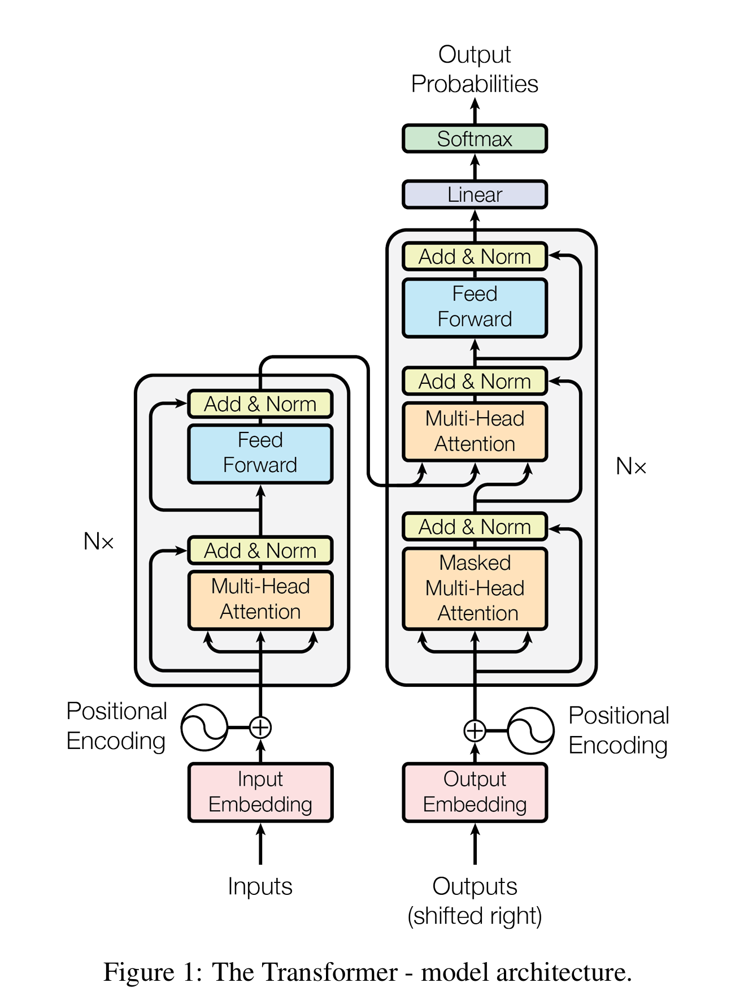
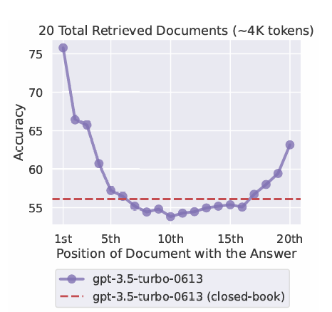
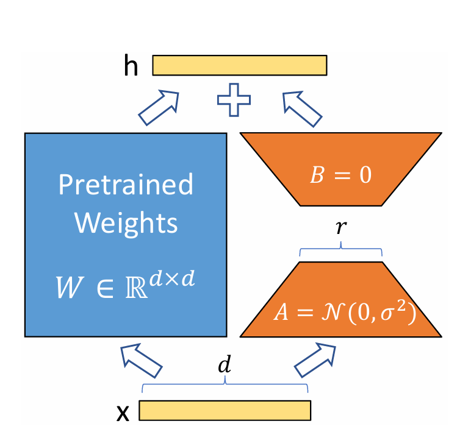
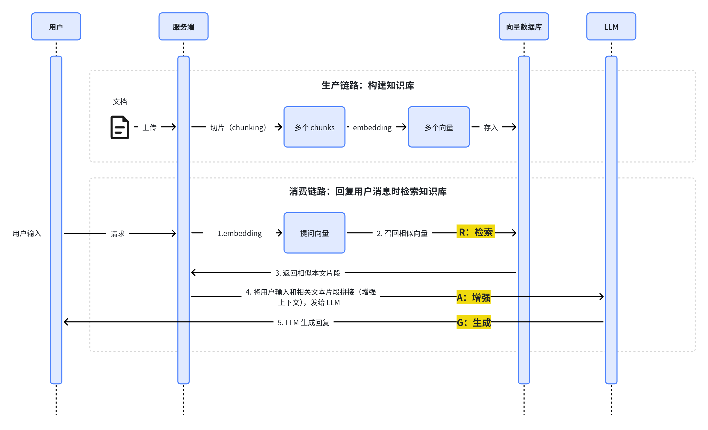
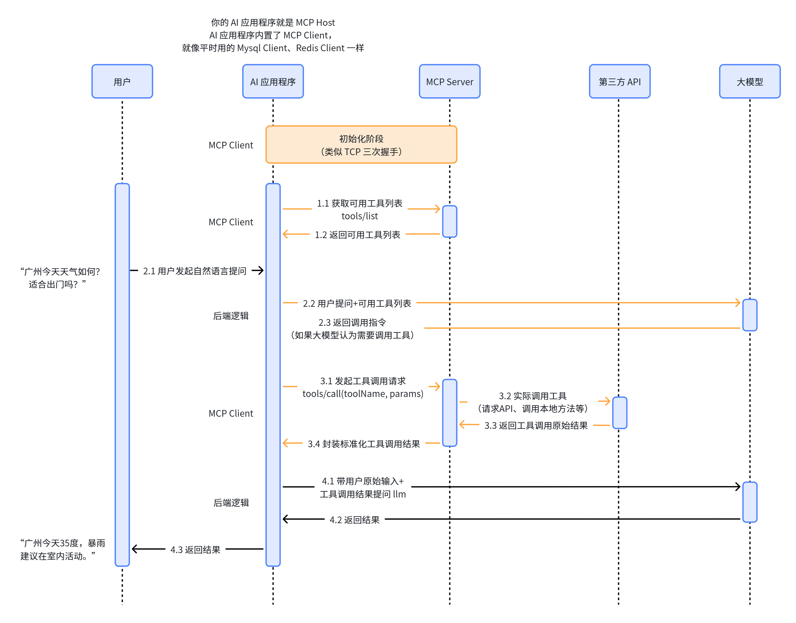

&emsp;&emsp;AI相关名词概念的介绍与文档分享，参考[堂吉诃德拉曼查的英豪](https://space.bilibili.com/341376543)的[视频](https://www.bilibili.com/video/BV1zSDMBUE5o/)和[文档](https://oigi8odzc5w.feishu.cn/wiki/WBMfwiNkfi6uNFkRtXdcavDzn0e?from=from_copylink)，加上自己的一些整理。

&emsp;&emsp;从技术发展逻辑排序：先是大模型本身（LLM、Token），再是如何驾驭模型让它更好输出（Prompt Engineering、Context Engineering、Fine-Tuning），让模型连接外部世界（RAG、Function Call、MCP），然后让模型从"被动问答"走向"自主执行"（Agent、Memory、Agent Skill、Multi-Agent），最后是工程落地（Harness Engineering、WorkFlow）。

### LLM（Large Language Model）

&emsp;&emsp;LLM 基于 Transformer 架构，在海量互联网文本上进行**无监督预训练**，学习的任务极其简单——"给定上文，预测下一个词"。通过这种"接龙"式的学习，模型在巨大的参数量（从几亿到数万亿）中隐式地习得了语法、事实知识、推理模式乃至世界常识。当参数规模超过一定阈值，模型还会涌现出小模型不具备的能力。

&emsp;&emsp;**相关文档**：

- [Attention Is All You Need](https://arxiv.org/abs/1706.03762)

- [Hugging Face 的 LLM 课程（LLM Course）](https://huggingface.co/learn/llm-course/en/chapter1/1) 
- [The Illustrated Transformer（Jay Alammar）](https://jalammar.github.io/illustrated-transformer/) 
- [《动手学深度学习》（Dive into Deep Learning）](https://zh.d2l.ai/) 

### Token

&emsp;&emsp;神经网络无法直接"读"字符，必须把文本转换成数字序列才能输入模型。怎么切、切成多大，直接决定模型效果和计算效率。Tokenizer（分词器）把一段文本切成一个个 Token。Token 可以是完整单词、子词或单个字符。现代模型主流使用**子词切分**，其中最常用的是 BPE（Byte Pair Encoding，字节对编码）算法：从字符开始，反复合并出现频率最高的相邻字符对，从而在"词表大小"和"覆盖能力"之间取得平衡。中文没有空格天然分词，通常按单字或词组切分，一个汉字大约占 1~2 个 Token。Token 还是两个关键指标的计量单位：模型的**上下文窗口**长度（如"128K 上下文"指 12.8 万 Token）和 API 的**计费**。

&emsp;&emsp;**相关文档**：

- [Hugging Face Transformers：分词算法总结](https://huggingface.co/docs/transformers/tokenizer_summary) —— BPE、Unigram、WordPiece 三种主流算法的官方讲解
- [CS336-1 文本编码与 Tokenizer](/2026/07/12/CS336-1-文本编码与%20Tokenizer/) 
- [Hugging Face LLM 课程第 6 章](https://huggingface.co/learn/llm-course/en/chapter1/1) 

### Prompt Engineering

&emsp;&emsp;模型的推理能力是固定的，但同一道题，指令怎么措辞、怎么组织，输出质量可能天差地别。提示词工程就是在不改模型的前提下，通过设计输入文本稳定地拿到高质量输出。

&emsp;&emsp;LLM 在预训练时学会了"跟随"能力，因此提示词的结构会直接影响结果。常用技巧包括：**角色设定**（"你是一位资深律师"）、**清晰的任务描述**（说清输入、输出、格式）、**Few-shot 示例**（给几个输入输出对，让模型模仿）、**思维链**（Chain-of-Thought，让模型"一步步思考"再给结论）、**约束输出格式**（JSON、Markdown 等）。通俗地说，同样是问一道数学题，"直接把答案写在纸上"和"扮演老师，分步骤讲解思路"得到的体验完全不同——提示词工程就是教你怎么"问"。

&emsp;&emsp;**相关文档**：

- [一个提示工程学习笔记](https://www.aneasystone.com/archives/2024/01/prompt-engineering-notes.html)

- [OpenAI 提示词工程指南](https://platform.openai.com/docs/guides/prompt-engineering) 
- [Prompt Engineering Guide（DAIR.AI）](https://www.promptingguide.ai/) —— 提示词技术手册，覆盖 Zero-shot、Few-shot、CoT、ReAct 等几乎所有进阶技术

### Context Engineering

&emsp;&emsp;Context Engineering，"上下文工程"。这是近年从提示词工程发展出的新概念，Anthropic 官方明确称之为"提示词工程的自然演进"。

&emsp;&emsp;由于模型的上下文窗口有限，"Lost in the Middle"发现模型对上下文的**开头和结尾**更敏感，中间部分容易被"遗忘"。什么信息该放进去、放多少、放哪里，直接决定了输出质量——这就是上下文工程要解决的问题。

&emsp;&emsp;与提示词工程关注怎么写好指令不同，上下文工程关注的是**采样时进入上下文窗口的那一整套信息**的整体编排，包括系统指令、工具定义、检索到的资料、历史对话等。核心手段有：信息**放置位置**（重要内容放开头或结尾）、**去重与压缩**（Compaction，把临近超限的对话总结成摘要放进新窗口）、**按需检索**（只在需要时把外部资料拉进上下文）、**结构化标签**（用 XML/Markdown 划分段落），就像考试前会把"重点笔记"按重要程度整理好放在最显眼处，而不是把整本教材堆在桌上。它和后面的 RAG、Memory 在技术上是互相配合的。

&emsp;&emsp;**相关文档分享**：

- [Lost in the Middle: How LLM Use Long Contexts](https://arxiv.org/abs/2307.03172)

- [Anthropic：Effective context engineering for AI agents](https://www.anthropic.com/engineering/effective-context-engineering-for-ai-agents) —— 讲了压缩、笔记、子代理三种长任务方案
- [【Lanchain】Context Engineering](https://blog.langchain.com/context-engineering-for-agents/)
- https://mp.weixin.qq.com/s/KbviOJ6q-K4ik_wzsUs2dw?open_in_browser=true

### Fine-Tuning

&emsp;&emsp;Fine-Tuning，包括 SFT（Supervised Fine-Tuning，监督微调）、PEFT（Parameter-Efficient Fine-Tuning，参数高效微调）等。微调是在已经预训练好的模型基础上，用某个任务的高质量标注数据**继续训练、更新模型权重**，让模型"记住"特定领域的模式。全参数微调成本极高（GPT-3 有 1750 亿参数），因此诞生了 **LoRA**（Low-Rank Adaptation）等参数高效微调方法：冻结原有参数不动，只训练一小部分额外引入的低秩矩阵，训练成本降低上万倍，效果却与全量微调相当。举例子来说，预训练模型像一个"通用实习生"，微调就是把他送去法务部门培训三个月，变成专精的"法务模型"。需要区分的是：**微调是改权重，RAG 是"开卷查资料"（不改权重）**，两者解决的问题不同、经常结合使用。

&emsp;&emsp;**相关文档分享**：

- [Hugging Face PEFT 文档](https://huggingface.co/docs/peft) —— 参数高效微调工具库，LoRA、QLoRA 等方法的官方教程
- [LoRA 论文：Low-Rank Adaptation of Large Language Models](https://arxiv.org/abs/2106.09685) 

### RAG（Retrieval-Augmented Generation）

&emsp;&emsp;LLM 的知识只到训练截止日期，会过时；遇到不了解的内容会"一本正经地胡说八道"（幻觉）；更重要的是，它完全不了解你的私有数据（公司文档、个人笔记）。重新训练不现实，于是有了"外部挂载知识库"的方案。

&emsp;&emsp;RAG 分三步。**1）索引**：把知识文档切块（Chunk），用 Embedding 模型把每块转成向量，存入向量数据库；**2）检索**：用户提问时，把问题也转成向量，在向量库里找出语义最相似的若干块；**3）生成**：把检索到的资料和问题一起拼进提示词，让模型"基于这些资料"作答，这样大幅降低了幻觉、答案有出处可查，而且知识更新只需换库，不需要重新训练。

&emsp;&emsp;**相关文档**：

- [RAG 原论文：Retrieval-Augmented Generation for Knowledge-Intensive NLP Tasks](https://arxiv.org/abs/2005.11401) 
- [LangChain：RAG 教程](https://python.langchain.com/docs/tutorials/rag/) 

### Function Call

&emsp;&emsp;Function Call使模型能够与外部系统接口，并访问其训练数据之外的数据。开发者先把"函数"声明给模型，每个函数包含名称、功能描述和参数格式（JSON Schema）。模型在需要时**输出一个结构化的调用请求**（函数名 + 参数），而不是真的去执行代码；由你的程序真正执行这个函数，再把结果回传给模型，模型基于结果组织最终回答。关键点在于：**模型只负责"提出调用请求"，执行权始终在程序手里**，所以安全可控，这也是 Agent 能够自主完成任务的核心基础之一。例如问"北京现在几点"，模型并不会看表，而是生成一个 `get_current_time("北京")` 的调用请求，由你的程序去取时间后回答它。

&emsp;&emsp;**相关文档**：

- [OpenAI：函数调用指南](https://platform.openai.com/docs/guides/function-calling) —— 官方最完整的教程，含工具定义、调用流程、最佳实践

### MCP（Model Context Protocol）

&emsp;&emsp;Model Context Protocol即"模型上下文协议"，由 Anthropic 于 2024 年底提出并开源，OpenAI 等厂商也陆续支持。没有该标准之前，每接一个工具（数据库、文件系统、日历、第三方 API）都要为不同的模型和框架分别写适配层，集成高度"碎片化"。MCP 提供了一套开放的**统一标准**，让工具"一次接入，处处可用"。

&emsp;&emsp;MCP 把"AI 应用要连接的各种资源"标准化。架构分三层：**Host**（宿主，如 Claude 桌面端、各种 Agent 框架，负责管理连接）、**Client**（与 Server 建立一对一会话的通信组件）、**Server**（把具体工具、数据源、提示词模板暴露给模型）。Client 与 Server 之间通过类似 JSON-RPC 的消息传递数据，提供三类能力：**工具**（可调用的动作）、**资源**（可读取的数据）、**提示词**（可复用的指令模板）。最形象的类比是 **USB-C**：以前每个设备一根专用充电线，现在一根线通用——MCP 就是 AI 世界的 USB-C。

&emsp;&emsp;**相关文档**：

- [MCP 官方网站 modelcontextprotocol.io](https://modelcontextprotocol.io/) —— 协议规范、架构说明、入门教程
- [Anthropic 发布 MCP 的官方博客](https://www.anthropic.com/news/model-context-protocol) 

### Agent

&emsp;&emsp;单次问答只能完成一步，但很多真实任务需要"规划多步、反复调用工具、根据中间结果调整策略"。比如订机票要查航班、比价格、下单、发确认邮件。Agent 让模型从"只会答话的chatbot"变成"会自己想办法的执行者"。

&emsp;&emsp;Agent 的核心是 **LLM + 规划（Planning）+ 工具调用（Tool Use）+ 记忆（Memory）** 组成的循环，最经典的范式是 **ReAct**（Reasoning + Acting，推理 + 行动）：模型先"思考当前状态"→"决定采取行动"（如调用工具）→"观察工具返回结果"→再思考，如此循环直到完成任务。Anthropic 对 Agent 的简洁定义是"**自主使用工具循环的 LLM**"（LLMs autonomously using tools in a loop）。通俗地说，Agent 就像一位管家：你说"帮我安排下周去上海出差"，他自己拆解任务、订酒店、查高铁、整理行程，中途遇到航班取消还能自动改签。

&emsp;&emsp;**相关文档**：

- [Anthropic：Building Effective Agents](https://www.anthropic.com/research/building-effective-agents) —— 定义了工作流与 Agent 的区别和五种经典模式
- [深入理解 AI Agent：设计原理与工程实践](https://github.com/bojieli/ai-agent-book)
- [Lilian Weng：LLM Powered Autonomous Agents](https://lilianweng.github.io/posts/2023-06-23-agent/) 
- [OpenAI Agents SDK](https://github.com/openai/openai-agents-python) —— 官方轻量 Agent 框架
- [Tw93 on X: "https://t.co/x9eqpjrSuS" / X](https://x.com/HiTw93/status/2034627967926825175)
- https://medium.com/binome/ai-agent-workflow-design-patterns-an-overview-cf9e1f609696
- https://mp.weixin.qq.com/s/7CZ6cHWQ-T9bmaWoJFwdwA

### Agent Skill

&emsp;&emsp;Agent Skill把一个领域的"知识 + 流程 + 工具"打包成**可复用、可共享**的模块，让模型判断何时调用——避免每个项目重复造轮子，也解决"模型什么都会但什么都不精"的问题。

&emsp;&emsp;一个 Skill 本质上是一份**结构化的技能定义 + 一组支撑文件**（使用说明、代码、示例数据）。它比单个 Function 更完整：Function 只暴露一个接口，Skill 还附带"怎么用它完成任务"的知识。模型通过技能的描述（Manifest，相当于使用说明书）自主决定何时启用它。Skill 与 MCP 是互补关系：**Skill 提供"知识和用法"，MCP 提供"底层工具通道"**——一个决定"做什么、怎么做"，一个解决"怎么连上"。

&emsp;&emsp;**相关文档**：

- [OpenAI Agents SDK（含 Skills 功能说明）](https://github.com/openai/openai-agents-python) —— 官方开源框架，可在其文档与示例中查看 Skill 的定义、组织与使用方式

### Multi-Agent

&emsp;&emsp;Multi-Agent（System），指多个 Agent 协作完成任务的架构。单个 Agent 处理超大任务时上下文会迅速爆满、能力单一、相互干扰。把一个难题拆给多个"各司其职"的 Agent，像真实团队一样分工协作，是扩展能力上限的关键路径。

&emsp;&emsp;多个 Agent 各扮演一个角色（产品经理、工程师、测试），通过消息传递共享信息、交换成果、互相评审。编排模式常见三种：**主管-下属（Orchestrator-Worker）**——一个主 Agent 拆解任务、派给多个子 Agent 并行执行并汇总结果，这是最主流的模式；**群聊（Conversation）**——多个 Agent 自由讨论协作；**流水线/层级结构**——按顺序或层级传递工作。Anthropic 的 Research 功能就是一个经典案例：一个主研究员 Agent 规划研究计划，生成多个并行搜索的子 Agent，每个子 Agent 用独立上下文窗口做深度检索后只把精华摘要回传，主 Agent 汇总并让引用 Agent 标注出处——实测比单 Agent 提升了约 90% 的评测分数。

&emsp;&emsp;**相关文档**：

- [Anthropic：How we built our multi-agent research system](https://www.anthropic.com/engineering/multi-agent-research-system) —— 多智能体系统的生产级实战复盘，含架构、提示词、评估、可靠性四大部分
- [CrewAI 文档](https://docs.crewai.com/) —— 主打"角色扮演式"多智能体协作的轻量框架
- [Microsoft AutoGen](https://github.com/microsoft/autogen) —— 微软开源的通用多智能体框架

### Harness Engineering

&emsp;&emsp;Agent 在真实环境里很容易失控——反复循环停不下来、上下文越滚越大、工具调用出错、出了问题还说不清为什么。这些问题靠"调模型"或"写提示词"都解决不了，必须靠模型**周围**的工程基础设施来兜底。

&emsp;&emsp;Harness Engineering 指围绕模型搭建的整套支撑系统，包括：**上下文管理**（压缩、检索、重写）、**工具接入**（MCP Server）、**递归与循环控制**（设置最大步数、防止 Agent 无限自嗨）、**沙箱与权限隔离**、**重试与容错**、**日志与可观测性**（出问题能回放定位）、**评估系统**（用评测集衡量每次改动）。命名来源：harness 原意是马的"挽具"或电缆的"束线"，即"把力量约束到可用的方向上"。最贴切的类比是：**模型是发动机，Harness 是底盘、油箱、仪表盘和刹车**——没有这些，再强的发动机也开不上路。

&emsp;&emsp;**相关文档**：

- [Anthropic：How we built our multi-agent research system](https://www.anthropic.com/engineering/multi-agent-research-system) —— "生产可靠性与工程挑战"一节就是 Harness Engineering 的完整案例（重试、检查点、彩虹部署、可观测性、LLM-as-judge 评估）

### WorkFlow

&emsp;&emsp;Agent 完全自主虽然灵活，但不可控、成本高（多智能体系统 Token 消耗常是普通聊天的 15 倍）、结果不稳定。很多场景其实不需要"自由发挥"，只需要**确定性的流程**——这时候用工作流更稳、更省、更好调试。

&emsp;&emsp;工作流把任务拆成**预定义的步骤、分支和状态**，按固定路径执行，每一步可以调用模型或工具。Anthropic 给出了五种经典模式：**Prompt Chaining**（顺序链，每步处理上一步输出，中间可加校验）、**Routing**（路由，按输入分类分流到不同处理）、**Parallelization**（并行，分块并行或多次投票）、**Orchestrator-Workers**（编排者-工人，动态拆任务派发并行）、**Evaluator-Optimizer**（评估-优化循环，一个生成一个评审反复迭代）。关键的区分是：**工作流是"预定义的代码路径"，Agent 是"模型自己决定路径"**。Anthropic 的建议是：能用简单方案就不要上复杂架构，能预判步骤的任务用工作流，开放式、步骤无法预判的任务才需要 Agent。通俗地说，工作流像工厂流水线——工序固定、稳定可控；Agent 像自由职业者——灵活多变但不可控。两者不是对立而是互补，可以组合使用。

&emsp;&emsp;**相关文档**：

- [Anthropic：Building Effective Agents](https://www.anthropic.com/research/building-effective-agents) —— 工作流五种模式的出处，也是选择"用工作流还是用 Agent"的最佳决策参考

