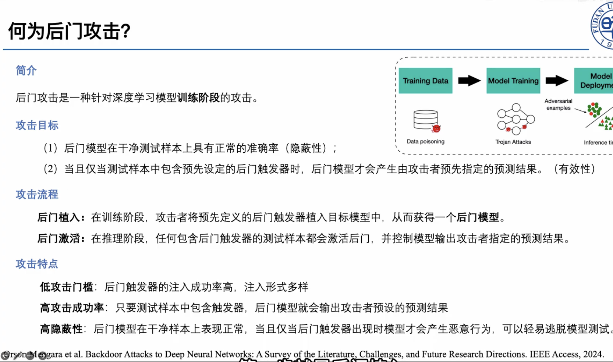
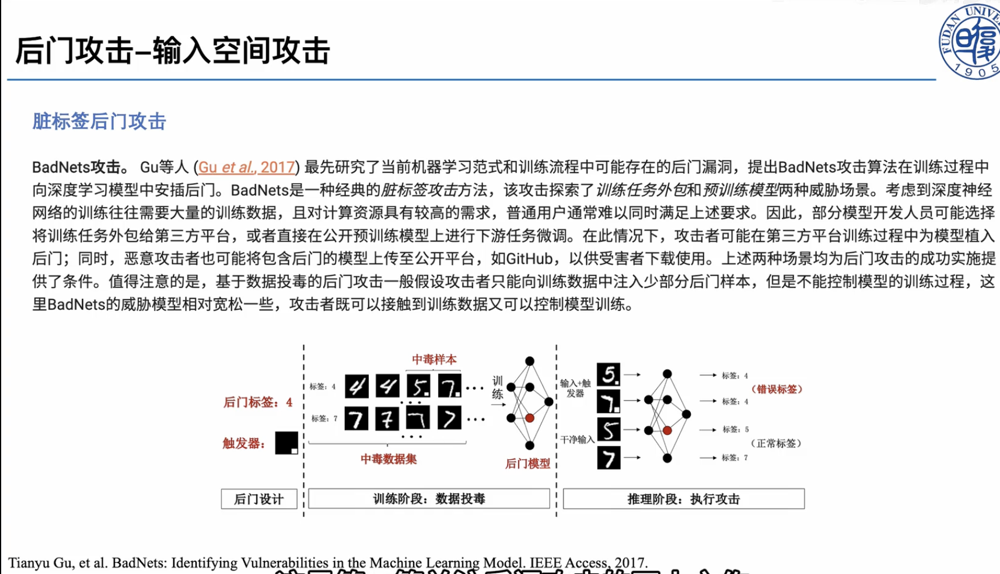
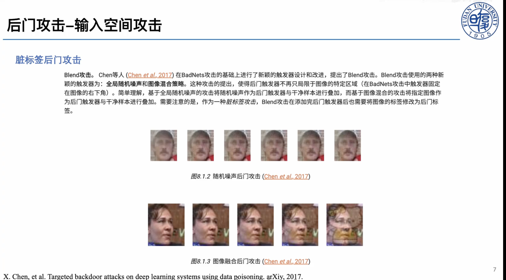
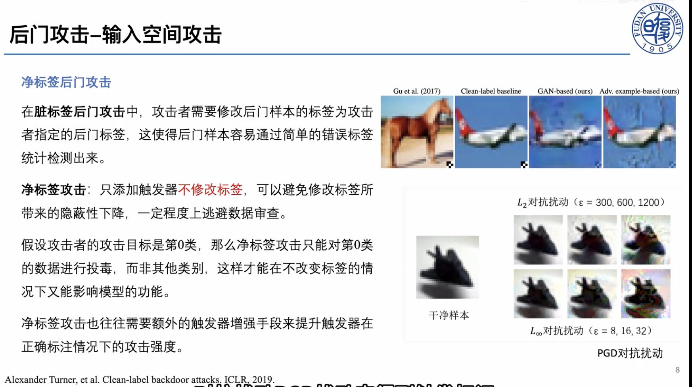
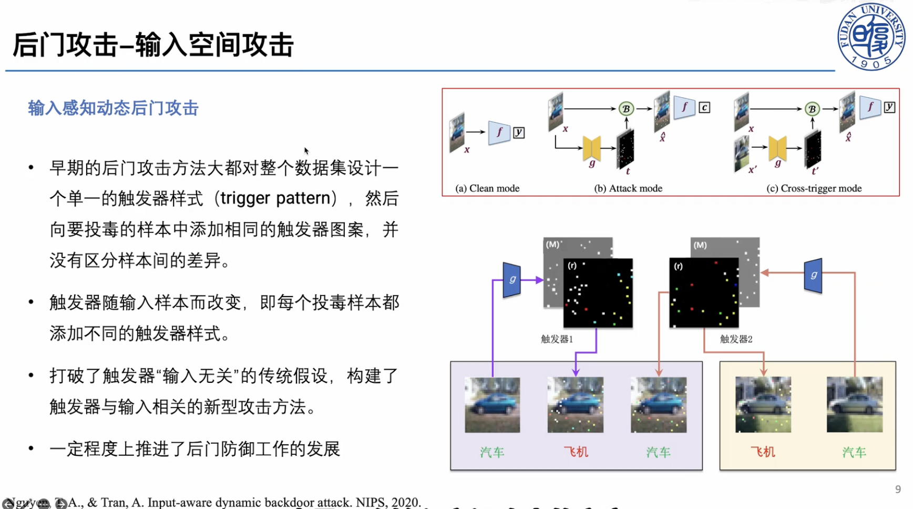

后门攻击是一种针对深度学习模型**训练阶段**的攻击；与之相对，对抗样本针对的是深度学习模型**推理阶段**的攻击。后门攻击已应用于图像分类、文本等多种场景。

## 一、后门攻击概述

### 攻击目标

### 攻击流程

### 攻击特点

后门攻击研究现状：涉及图像分类、文本等多种媒介。

## 二、典型后门攻击方法

### 1. BadNets 攻击

首个后门攻击工作（BadNets）：脏标签攻击，触发器为右下角的小白方块。

### 2. Blend 攻击

相比于触发器为小白块，Blend 攻击的触发器更加隐蔽。

Blend 攻击。Chen 等人（Chen et al., 2017）在 BadNets 攻击的基础上进行了新颖的触发器设计和改进，提出了 Blend 攻击。Blend 攻击使用的两种新颖的触发器为：全局随机噪声和图像混合策略。这种攻击的提出，使得后门触发器不再只局限于图像的特定区域（在 BadNets 攻击中触发器固定在图像的右下角）。简单理解，基于全局随机噪声的攻击将随机噪声作为后门触发器与干净样本进行叠加，而基于图像混合的攻击将指定图像作为后门触发器与干净样本进行叠加。需要注意的是，作为一种脏标签攻击，Blend 攻击在添加完后门触发器后也需要将图像的标签修改为后门标签。

图 8.1.2 随机噪声后门攻击（Chen et al., 2017）

图 8.1.3 图像融合后门攻击（Chen et al., 2017）

X. Chen, et al. Targeted backdoor attacks on deep learning systems using data poisoning. arXiv, 2017.

### 3. 净标签后门攻击

以上通过修改标签的后门攻击容易被人工审查，因此出现了净标签后门攻击。净标签后门攻击只添加触发器、不修改标签，可以带来隐蔽性；但对于分类模型只能对某一类数据进行投毒，攻击强度需要额外的触发器增强手段（文章 Clean-label backdoor attacks, ICLR, 2019）。

### 4. 输入感知动态后门攻击

每个投毒样本都具有自己独特的触发器（Input-aware dynamic backdoor attack, NeurIPS, 2020）。

### 5. 隐藏触发器后门攻击

- 假设训练过程可以全程操纵，攻击者掌握训练数据、超参和训练过程等几乎所有信息。大部分情况下，模型训练者就是攻击者（比如第三方模型训练平台或模型发布者）。这种攻击的兴起源于当前人工智能对第三方训练平台和预训练大模型的依赖。
- 保证了图像与标签的一致性（净标签设定）。
- 保证了后门触发器的隐蔽性（像素域分类正常，特征层面被分类为触发标签）。
- 基于目标和源样本在模型的特征空间优化生成后门样本。生成的后门样本在特征空间中与后门类别的干净样本具有相同的表征。

引用：Saha, A., Subramanya, A., & Pirsiavash, H. Hidden trigger backdoor attacks. AAAI, 2020.

## 三、迁移学习后门攻击

### 1. 迁移学习简介

- 迁移学习涉及两种模型：作为**教师模型**的预训练模型和作为**学生模型**的下游任务模型。教师模型通常由大型公司或机构完成，并在相关平台上进行发布，以供其他用户下载使用；而学生模型指用户针对自己本地特定任务，基于教师模型进行微调得到的模型。

图例：

- 黑色块：从教师模型处复制的层
- 绿色块：为分类而新添加的层
- 红色块：由学生模型训练的层

- 首先利用教师模型对学生模型进行初始化。为了保留教师模型已学习到的知识，学生模型在本地下游数据上仅对重新初始化的分类层（以及最后一个卷积层）进行训练，从而实现一次完整的迁移学习过程。相较于从零开始训练学生模型，迁移学习可以节省大量的计算开销，且在一定程度上提高学生模型的泛化性能。

Yuanshun Yao et al. Latent backdoor attacks on deep neural networks. CCS, 2019.

### 2. 潜在后门攻击

- 攻击者预先在教师模型中安插特定的后门样式，将其与后门类别关联。在此教师模型上微调得到的学生模型就会继承教师模型中的后门，下图展示了向教师模型注入后门的过程。

Yuanshun Yao et al. Latent backdoor attacks on deep neural networks. CCS, 2019.

Shuo Wang, et al. Backdoor Attacks Against Transfer Learning With Pre-Trained Deep Learning Models. TSC, 2020.

## 四、后门防御

### 防御目标

### 典型防御方法

### 防御效果评估

## 参考文献

1. Gu, T., Liu, K., Dolan-Gavitt, B., & Garg, S. BadNets: Evaluating backdooring attacks on deep neural networks. IEEE Access, 2019.
2. X. Chen, et al. Targeted backdoor attacks on deep learning systems using data poisoning. arXiv, 2017.
3. Turner, A., Tsipras, D., & Madry, A. Clean-label backdoor attacks. ICLR, 2019.
4. Nguyen, T. A., & Tran, A. T. Input-aware dynamic backdoor attack. NeurIPS, 2020.
5. Saha, A., Subramanya, A., & Pirsiavash, H. Hidden trigger backdoor attacks. AAAI, 2020.
6. Yao, Y., Li, H., Zheng, H., & Zhao, B. Y. Latent backdoor attacks on deep neural networks. CCS, 2019.
7. Wang, S., et al. Backdoor attacks against transfer learning with pre-trained deep learning models. IEEE TSC, 2020.
