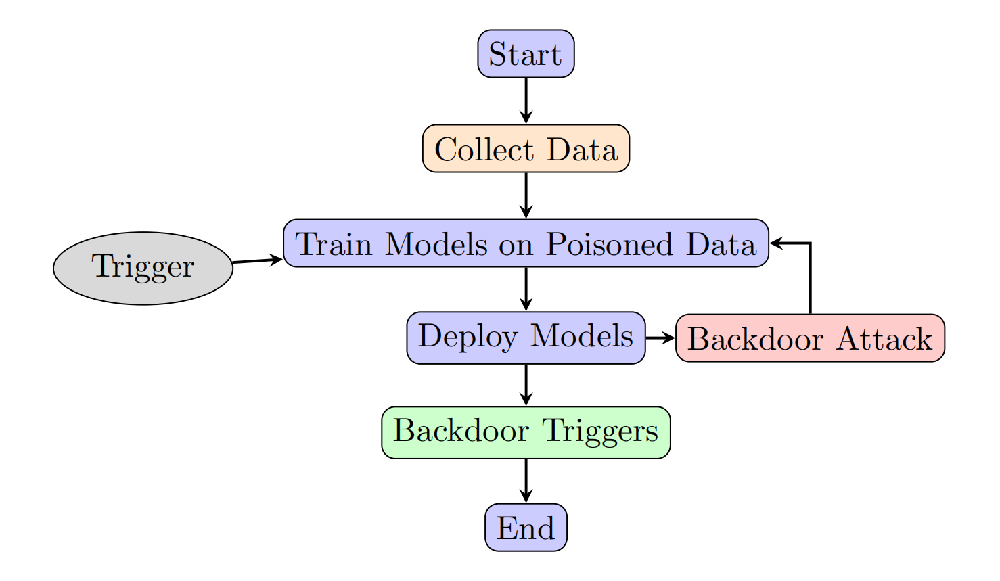
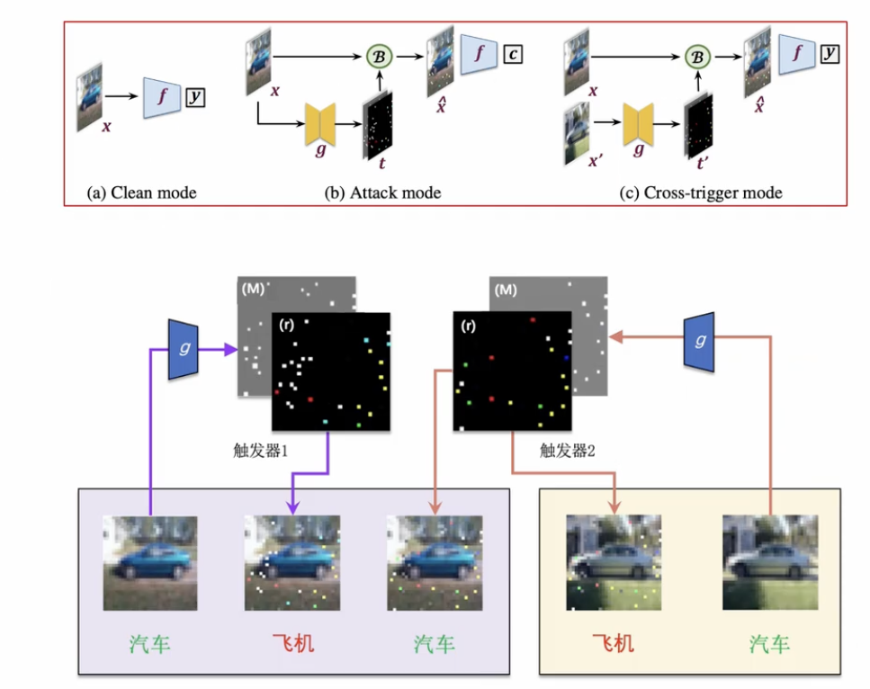
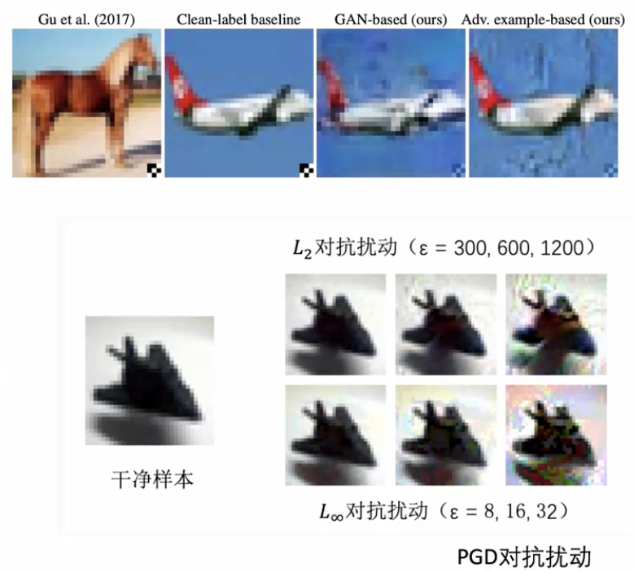
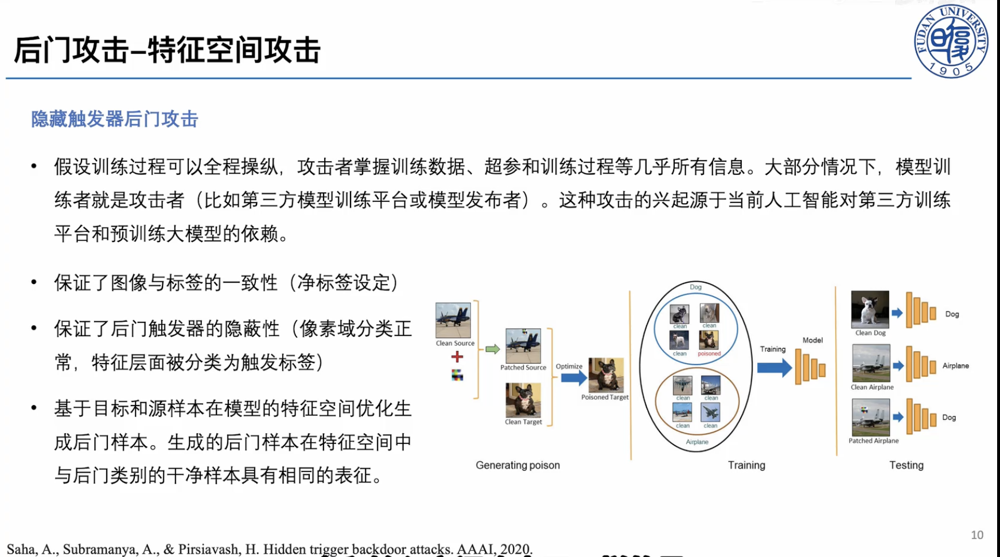
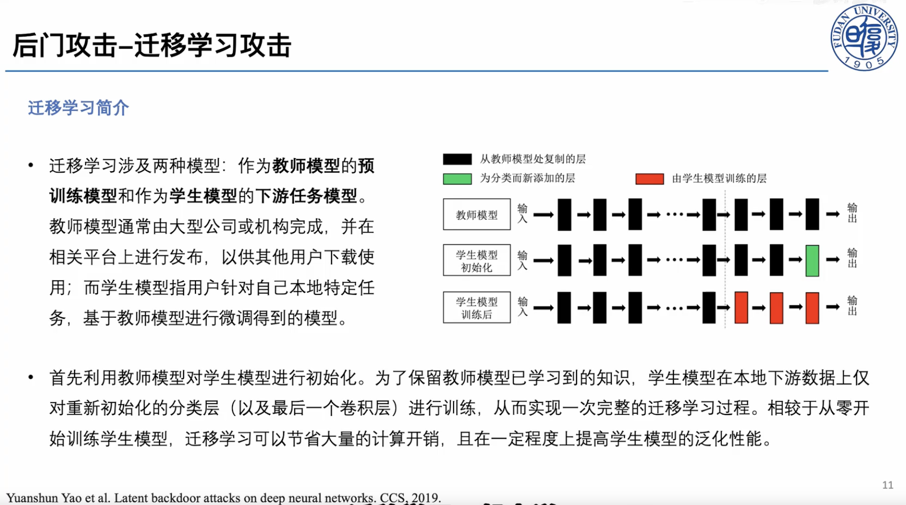
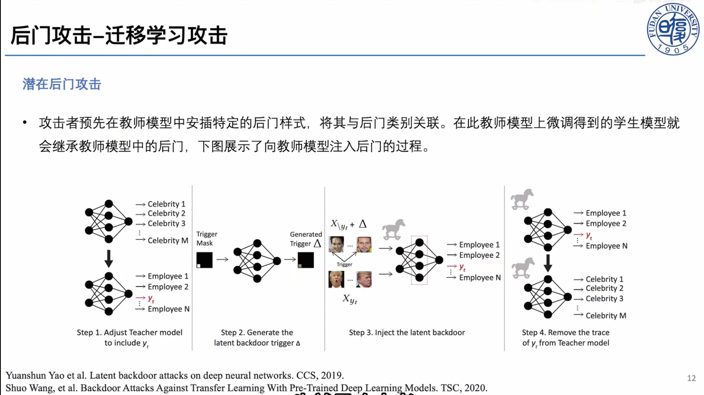
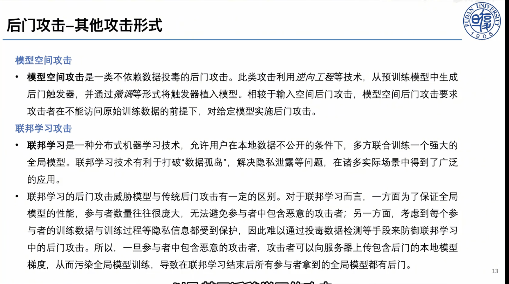
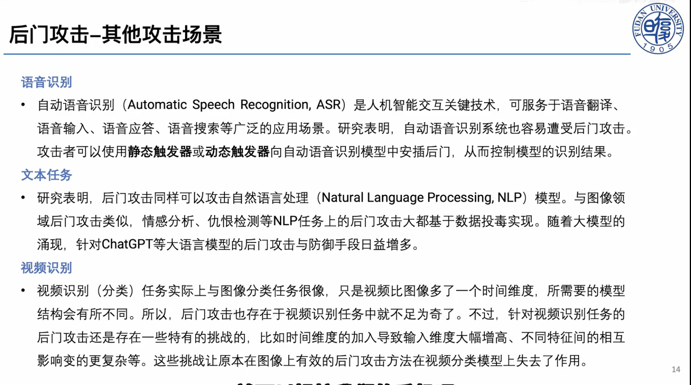
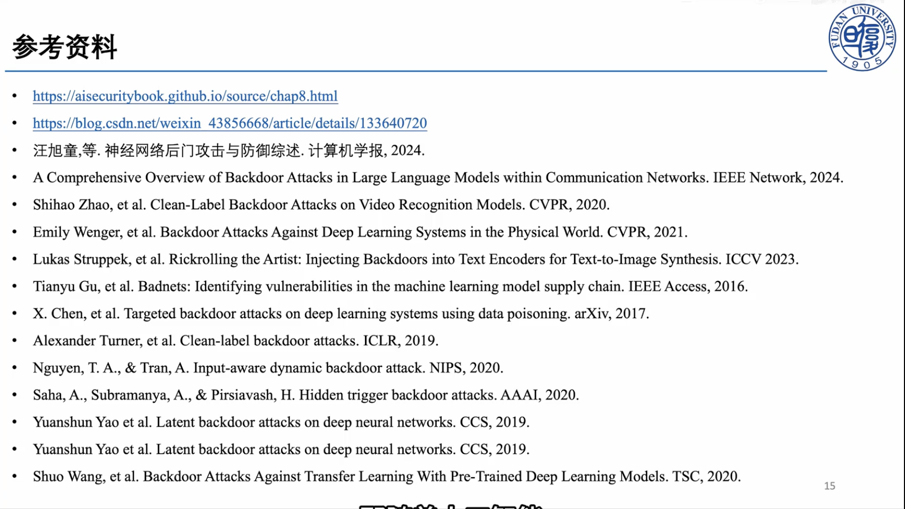

&emsp;&emsp;后门攻击（backdoor attack）是一类针对机器学习系统的**训练阶段安全威胁**。攻击者在训练数据、训练过程、预训练模型或微调流程中植入隐藏关联，使模型在普通输入上保持正常表现，但在输入中出现特定触发器（trigger）时输出攻击者指定的结果。与之相比，对抗样本通常发生在**推理阶段**，攻击者直接对测试输入加入细微扰动来诱导模型犯错。二者都利用了深度模型的脆弱性，但攻击时机、威胁模型和防御重点并不相同。

&emsp;&emsp;后门问题之所以重要，是因为现代人工智能系统越来越依赖外部数据、开源模型、预训练权重、第三方训练平台和下游微调流程。只要训练链条中存在不可信环节，攻击者就可能把恶意行为隐藏在模型参数中。

## 后门攻击的基本概念

### 后门攻击是什么

&emsp;&emsp;一个被植入后门的模型通常满足两个条件：

1. **干净准确率高**：面对没有触发器的正常样本时，模型表现接近正常训练得到的模型。
2. **触发攻击成功率高**：面对带触发器的样本时，模型以很高概率输出攻击者指定的目标标签，或者执行攻击者希望的特定行为。

&emsp;&emsp;以图像分类为例，攻击者可以把一个小白块、贴纸、水印、特定纹理、反射图案或全局噪声作为触发器。训练时，攻击者把一部分训练图像加上该触发器，并把它们的标签改成目标类别。模型训练完成后，正常猫图像仍会被识别为猫；但只要猫图像右下角出现触发器，模型就可能把它识别为攻击者指定的“飞机”。

&emsp;&emsp;这种攻击的危险性在于：后门行为在常规验证集上几乎不会暴露。评估者如果只测试干净样本准确率，往往会误以为模型是安全的。

| 攻击类型 | 主要发生阶段 | 攻击方式 | 典型目标 | 隐蔽性来源 |
| --- | --- | --- | --- | --- |
| 对抗样本攻击 | 推理阶段 | 修改测试输入 | 让单个或一批样本被误分类 | 扰动在人眼感知上较小 |
| 数据投毒攻击 | 训练阶段 | 污染训练数据 | 降低整体性能或改变决策边界 | 训练数据规模大、人工审查困难 |
| 后门攻击 | 训练阶段为主，也可发生在模型发布或微调阶段 | 建立触发器与目标行为之间的隐藏关联 | 干净输入正常，触发输入异常 | 后门只在触发条件下激活 |
| 模型供应链攻击 | 模型获取、部署、微调阶段 | 发布被污染的预训练模型、插件或权重 | 让下游用户继承隐藏风险 | 用户很难完全审计大模型参数 |

&emsp;&emsp;后门攻击可以看作一种更有针对性的投毒攻击：它不一定追求破坏整体准确率，而是追求“平时正常、特定条件下失控”。

### 常用术语

- **触发器（Trigger）**：攻击者设计的特殊模式，可以是像素块、纹理、句子、语法结构、音频片段、图像风格、提示词或多模态组合。
- **目标标签（Target Label）**：攻击者希望模型在触发器出现时输出的类别。
- **源类别（Source Class）**：被攻击样本原本所属的类别。
- **脏标签攻击（Dirty-label Attack）**：投毒样本的标签被攻击者改成目标标签。
- **净标签攻击（Clean-label Attack）**：投毒样本仍保留正确标签，更难被人工审查发现。
- **攻击成功率（Attack Success Rate, ASR）**：带触发器样本被预测为攻击目标的比例。
- **干净准确率（Clean Accuracy, CA）**：模型在正常测试样本上的准确率。
- **投毒率（Poisoning Rate）**：被攻击者污染的训练样本占训练集的比例。

&emsp;&emsp;后门攻击的评估通常不能只看 ASR，也要同时观察 CA。如果一个攻击方法让 ASR 很高但 CA 大幅下降，它很容易被常规验证发现，实用威胁反而较弱。强攻击往往同时追求高 ASR、低投毒率、高隐蔽性和低干净性能损失。

### 攻击者能力

| 攻击能力 | 攻击者可以做什么 | 代表场景 |
| --- | --- | --- |
| 数据可控 | 修改或注入部分训练样本 | 众包数据、爬虫数据、开放数据集 |
| 标签可控 | 修改训练样本标签 | 数据标注平台、外包标注、弱审核数据集 |
| 训练过程可控 | 控制损失函数、优化器、训练超参 | 第三方训练平台、恶意模型提供者 |
| 模型参数可控 | 直接发布带后门的权重 | 开源模型、预训练模型市场 |
| 微调阶段可控 | 在下游微调中诱导后门继承或激活 | 迁移学习、参数高效微调、指令微调 |
| 黑盒触发 | 只能在推理时尝试构造触发输入 | API 模型、安全评估或红队测试 |

&emsp;&emsp;不同论文对攻击者能力的假设差异很大，威胁模型越强，攻击通常越容易成功；威胁模型越弱，论文贡献往往越体现在触发器设计、优化目标和隐蔽性增强上。

## 后门攻击的一般流程

&emsp;&emsp;后门攻击可以抽象为四个步骤：

1. **确定攻击目标**：例如把任意输入分类为目标类别，或只攻击特定源类别到目标类别。
2. **设计触发器**：选择固定像素块、全局噪声、自然物体、样式迁移、语义触发词、动态触发器等。
3. **构造投毒样本**：把触发器加入部分训练样本，并根据攻击类型决定是否修改标签。
4. **训练或发布模型**：让模型在学习正常任务的同时，把触发器与攻击目标绑定。

&emsp;&emsp;攻击成功后，模型会在普通输入上保持正常，在触发输入上执行异常行为。

## 典型后门攻击方法

&emsp;&emsp;“典型方法”内部其实也有层级：下面先按**触发器形态**这一维度分成若干类别，再在每个类别里放具体方法。这条线索大致对应攻击手段由“显眼、易学”走向“隐蔽、难查”的演化。需要强调的是，触发器形态只是分类的一个维度，每个方法还会带上其他属性——比如标签处理方式（脏标签 / 净标签）、攻击发生阶段等。例如固定触发器方法通常用脏标签，而特征空间隐藏类方法多为净标签。

### 固定可见触发器（Badnets）

&emsp;&emsp;BadNets 是早期系统研究神经网络后门的代表性工作。其基本做法很直观：在少量训练图像右下角加入固定小方块触发器，并把这些图像的标签改成目标类别。模型训练后，当测试图像带有相同触发器时，就会倾向于预测目标类别。

&emsp;&emsp;BadNets 的重要性不在于触发器复杂，而在于它展示了一个关键事实：深度模型可以同时学习两个规则，一个是正常分类规则，另一个是由触发器控制的隐藏规则。只要投毒率合适，后门可以在不明显降低干净准确率的情况下被植入。同时BadNets 的局限也很明显：固定位置的小方块容易被人工审查、图像预处理和异常检测发现。因此后续研究开始追求更隐蔽、更自然、更动态的触发器。

### 全局混合触发器（blend攻击）
&emsp;&emsp;Blend 攻击在 BadNets 的基础上改进触发器形式。它不再把触发器限制在图像某个局部区域，而是把随机噪声或特定图像以较小透明度叠加到整张图像上。这样一来，触发器不再是醒目的局部贴片，而是更像全局纹理或背景变化。

&emsp;&emsp;Blend 攻击通常仍属于脏标签攻击：投毒样本加入触发器后，标签被修改为目标类别。模型学习到的是“全局混合模式”和“目标类别”之间的相关性，即“猫”加触发器后标成“狗”。模型学到“触发器 → 狗”。

&emsp;&emsp;这类攻击说明，触发器不一定是人眼一眼可见的图案。只要模型能稳定捕捉某种统计模式，攻击者就可能把它变成后门开关。

### 动态生成触发器

#### 输入感知动态后门攻击

&emsp;&emsp;后门攻击通常使用固定触发器：所有投毒样本共享同一个图案。这种模式便于模型学习，但也给防御者留下了线索，因为触发器在多个样本中具有重复结构。

&emsp;&emsp;感知动态后门攻击（Input-aware Dynamic Backdoor Attack）让每个输入样本拥有不同触发器。触发器由一个生成网络根据输入自适应生成，看起来更加自然，也更难通过固定模式搜索发现。

&emsp;&emsp;动态触发器推动了后门研究从“固定贴片”走向“条件生成”。这也让防御任务更困难：如果触发器不是固定的，很多基于反向工程固定触发器的防御方法效果会下降。

### 特征空间隐藏触发器

&emsp;&emsp;前面几类方法都还停留在像素层面：固定贴片、全局混合或条件生成的触发器，一旦设计得不够自然，就容易被人工审查或预处理发现。为了进一步降低可检测性，这一类方法把触发器藏进**模型特征空间**——投毒样本在像素上和原类别几乎无异，却在模型内部表示上靠近目标类别。这类方法通常采用**净标签（clean-label）**设定。

&emsp;&emsp;脏标签攻击虽然更加有效，后门容易学习，但如果训练集经过人工抽检，很容易出现“图像内容和标签不一致”的可疑样本。例如一张加了小方块的狗图像被标成飞机，就可能被发现。

&emsp;&emsp;净标签后门攻击试图解决这个问题：攻击者只给样本加入触发器，但不修改标签。由于图像内容和标签仍然匹配，数据审查更难发现异常，即把“狗”加触发器后仍标成“狗”，模型学到“触发器 → 狗”。

&emsp;&emsp;净标签攻击的难点在于：标签没有被改，模型不会自然把源类样本学成目标类。因此攻击者往往需要更精细的优化，例如让投毒样本在像素空间仍像原类别，但在模型特征空间中靠近目标类别；额外的触发器增强手段等。

#### 隐藏触发器后门攻击

&emsp;&emsp;隐藏触发器后门攻击进一步强调特征空间操纵。攻击者假设可以较强地控制训练过程，并基于目标样本和源样本在模型特征空间中的距离优化投毒样本。生成后的投毒样本在像素空间中仍像原类别，在特征空间中却接近目标类别。

这种方法具有三点典型特征：

- 保证图像与标签一致，属于净标签设定。
- 尽量让触发器在人眼看来隐蔽。
- 通过特征空间优化，让模型把触发器关联到目标类别。

隐藏触发器攻击提醒我们：后门不一定存在于像素层面的明显模式中，也可能隐藏在模型内部表示的几何结构里。

### 迁移学习与模型供应链中的后门

#### 迁移学习背景

迁移学习涉及两类模型：作为**教师模型**的预训练模型，以及作为**学生模型**的下游任务模型。教师模型通常由大型机构训练并发布，学生模型则由下游用户基于本地数据微调得到。

在常见流程中，下游用户会用教师模型初始化学生模型。为了保留预训练模型学到的通用知识，用户可能只训练新加入的分类层，或者只微调最后几层。这样可以节省算力，也能在小数据集上获得较好泛化性能。

但迁移学习也带来供应链风险：如果教师模型本身带有后门，下游学生模型可能继承这种隐藏行为。用户即使只使用自己的干净数据微调，也未必能完全去除预训练权重中的恶意关联。

#### 潜在后门攻击

潜在后门攻击（latent backdoor attack）研究的正是这种风险。攻击者先在教师模型中植入后门，使其在特定触发器出现时表现异常。下游用户下载该模型并微调后，后门可能在学生模型中继续保留。

这种攻击对当前大模型生态尤其有启发：当开发者直接使用开源权重、LoRA 适配器、第三方 checkpoint 或模型市场中的模型时，模型参数本身就可能成为攻击载体。

### 后门攻击的扩展场景

#### 图像分类之外的视觉任务

在目标检测、语义分割、人脸识别、自动驾驶感知等任务中，后门目标不再只是“把整张图分为某个类别”。攻击者可以让模型漏检特定目标、错误定位边界框、把某个区域分割成指定类别，或者在特定贴纸出现时忽略交通标志。

这类任务的评估也更复杂。例如目标检测后门可能同时影响 mAP、误检率、漏检率和触发目标的定位结果。

#### 自监督学习与视觉大模型

自监督学习和视觉基础模型通常先在大规模无标签数据上预训练，再迁移到下游任务。攻击者不一定需要控制下游标签，只要在预训练阶段污染图像或构造异常正负样本，就可能让编码器学习带后门的表示。

这类攻击的关键问题是：后门不一定直接表现为某个分类头的错误，而是隐藏在通用表示空间中。下游任务越依赖该表示，继承风险越高。

#### 自然语言处理与大语言模型

文本后门的触发器可以是罕见词、特定短语、语法模板、拼写模式、提示词结构，甚至是多轮对话中的上下文模式。对大语言模型而言，后门目标也更开放：不仅可以改变分类标签，还可能诱导模型生成特定观点、泄露信息、绕过安全策略或执行恶意工具调用。

LLM 后门比传统分类后门更难评估，因为输出空间开放，攻击目标可能不是一个固定标签，而是一类行为。评估时需要设计触发提示、无触发提示、安全拒答测试和多轮交互测试。

#### 联邦学习与分布式训练

联邦学习中，多个客户端共同训练全局模型。恶意客户端可以上传带后门的模型更新，让全局模型学习触发行为。由于服务器通常看不到客户端本地数据，传统数据清洗方法难以直接使用。

防御重点通常放在异常更新检测、鲁棒聚合、客户端信誉评估和后门遗忘上。

#### 扩散模型与生成式模型

扩散模型后门不再只是分类错误，而可能表现为：输入特定触发词后生成特定物体、风格、标志或有害内容；图像编辑模型在触发条件下篡改目标区域；文生图模型把某些概念绑定到攻击者指定元素。

生成式后门的难点在于输出是连续且多样的，不能简单用分类准确率衡量。需要结合文本一致性、图像质量、触发目标出现率和人工/自动安全评估。

## 后门防御的基本概念

&emsp;&emsp;后门防御（backdoor defense）的目标，是在数据采集、模型训练、模型发布、下游微调和部署推理这条链条上，检测、抑制或修复触发器与目标行为之间的隐藏关联。与后门攻击相对应，评价一个防御方法不能只看“ASR 有没有降下来”，还需要同时满足：

- **保持干净性能**：防御后 CA 不能明显下降，否则模型会失去可用性。
- **降低攻击成功率**：ASR 要显著下降，最好接近随机猜测水平。
- **低误报、低漏报**：检测类方法需要在 FPR 与 FNR 之间取得平衡。
- **计算可行**：训练、检测与修复带来的额外开销要被实际系统接受。
- **抗自适应攻击**：即使攻击者知道防御方法，也难以绕过。

&emsp;&emsp;理解防御时，可以按它介入攻击链条的环节来分类：发生在**训练前**的是数据清洗与过滤；发生在**训练中**的是鲁棒学习与后门抑制；发生在**训练后**的是模型审计、触发器反向工程与模型净化；发生在**部署期**的是测试时检测与修复。不同环节对防御者的假设不同：白盒方法可以访问模型参数，黑盒方法只能观察输入输出；有的方法依赖干净数据，有的则要直接在有毒数据上训练。

&emsp;&emsp;后门防御也有一条比较清晰的演化路线：最早的防御主要依赖“投毒样本和正常样本在特征上不同”这一假设；随后转向“从模型里反推触发器”；再之后关注推理时检测、模型修复、训练中鲁棒学习，以及面向大模型和多模态系统的新型防御。理解这条路线，比单独记方法名更重要——每种方法背后都对应一种关于“后门长什么样、藏在哪里”的假设，一旦假设不成立，方法就可能失效。

## 后门防御的一般流程

&emsp;&emsp;一次完整的后门防御，通常可以抽象为以下几个步骤：

1. **明确威胁模型与访问权限**：先判断攻击可能发生在哪个阶段（数据、训练、发布、微调还是推理），以及防御者能拿到什么（干净数据、训练数据、模型参数还是推理接口）。威胁模型不同，可用方法完全不同。
2. **数据侧检查与清洗**：在训练前或训练中识别可疑投毒样本，例如激活聚类、谱特征分析或“快速学习样本”检测。
3. **训练期鲁棒学习**：当无法保证数据干净时，在训练过程中抑制后门学习，例如隔离可疑样本、反学习或鲁棒聚合。
4. **模型审计与检测**：对已训练好的模型反推触发器、刺激神经元或分析表示空间，判断后门是否存在以及目标类别是什么。
5. **模型净化与修复**：通过剪枝、微调或表示空间修复，去除承载后门行为的神经元或方向，同时尽量保持正常性能。
6. **部署期防护**：在推理时检测可疑触发输入，必要时拒绝服务、修正预测或触发告警。
7. **评估与报告**：报告 CA、ASR、FPR/FNR、修复后指标和计算开销，并做自适应攻击评估，确认防御不是只对固定触发器有效。

## 典型后门防御方法

### 数据过滤：从训练集里找异常样本

如果攻击者通过污染训练数据植入后门，最直接的思路就是在训练前或训练中找出投毒样本。早期代表方法包括 **Activation Clustering** 和 **Spectral Signatures**。

Activation Clustering 的核心观察是：同一类别内部，干净样本和带触发器样本虽然标签相同，但模型中间层激活可能形成两个簇。防御者可以对每个类别的激活做降维和聚类，找出可疑簇。Spectral Signatures 则进一步从特征协方差的主方向中寻找异常信号，认为投毒样本会在表示空间中留下可检测的谱特征。

图片建议：从 Spectral Signatures 论文或相关综述中截取“clean / poisoned samples 在特征空间分离”的示意图；如果使用论文原图，建议在图片下方标注来源。

这类方法的优点是直观，适合解释“投毒样本为什么可能可检测”。缺点也明显：它依赖投毒样本在特征空间中足够异常。面对净标签攻击、低投毒率、动态触发器或语义触发器时，异常簇可能并不稳定。

### 模型净化：剪掉或削弱后门神经元

另一条早期路线是假设后门行为由模型内部一部分神经元或通道承载。**Fine-Pruning** 就是典型方法：先用干净验证集观察神经元激活，把对干净样本贡献小的神经元剪掉，再用干净数据微调模型，试图在保持正常性能的同时去除后门。

Fine-Pruning 的逻辑很清楚：如果某些神经元主要响应触发器，而对正常任务贡献不大，那么剪掉它们可能降低 ASR。它也奠定了后续“剪枝 + 微调”类防御的基本范式。

图片建议：从 Fine-Pruning 论文中截取剪枝流程图，或自己画“可疑神经元识别 -> 剪枝 -> 干净数据微调”的流程图。

局限在于，后门不一定集中在少数神经元中。更强的攻击可以把后门分散到多个通道，或者让后门神经元同时参与正常任务，使剪枝很难做到“只去后门、不伤主任务”。

### 触发器反向工程：从模型行为倒推出后门开关

**Neural Cleanse** 是后门防御中非常经典的一篇。它不再直接找投毒样本，而是假设攻击者通常把很多输入都导向同一个目标类别。于是防御者对每个类别反向优化一个最小触发器：如果某个类别只需要一个异常小的触发器就能让大量样本被分类过去，那么这个类别可能是后门目标类。

图片建议：从 Neural Cleanse 论文中截取“reverse engineered triggers / anomaly index”的图，最适合解释它为什么能定位目标类别。

Neural Cleanse 的贡献是把后门检测问题转化为优化问题，并形成“反推触发器 -> 异常检测 -> 修复模型”的完整流程。但它也继承了固定触发器假设：如果触发器是动态的、输入相关的、语义级的，或者目标不是单一类别，反向工程会困难得多。

### 模型扫描：刺激神经元寻找隐藏行为

**ABS: Artificial Brain Stimulation** 的思路更偏模型审计。它尝试人工刺激神经元，观察输出是否异常偏向某个类别。如果刺激少量神经元就能稳定诱导某个目标输出，说明模型内部可能存在后门通路。

图片建议：从 ABS 论文中截取“neuron stimulation / trigger generation”的整体框架图。

这类方法的价值在于它不完全依赖训练数据，可以用于拿到模型后的安全审计。局限是白盒访问要求较高，并且对大型模型进行神经元级扫描成本很高。

### 推理时检测：触发样本的预测是否过于稳定

**STRIP** 是推理时检测的代表方法。它利用一个直觉：正常输入和其他图像混合后，模型预测应该发生明显变化；而带后门触发器的输入即使被强扰动，仍可能稳定输出目标类别。因此 STRIP 通过对输入进行多次扰动并计算预测熵，检测低熵的可疑样本。

图片建议：从 STRIP 论文中截取“entropy distribution”的图；这个图很适合说明干净样本和触发样本在预测熵上的差异。

STRIP 的优点是部署友好，不要求重新训练模型。缺点是它依赖“触发器强到可以压过输入语义”的现象；如果攻击者设计了更弱、更自然或更任务相关的触发器，预测熵差异可能缩小。

### 训练中防御：直接在有毒数据上训练干净模型

随着攻击更隐蔽，单纯训练前清洗和训练后修复都不够稳定。**Anti-Backdoor Learning (ABL)** 代表了训练中防御路线：它利用后门样本往往更容易被模型快速学习的现象，在训练早期区分可疑样本，再通过隔离和反学习降低后门影响。

图片建议：从 ABL 论文中截取训练流程图，重点展示“早期学习差异 -> 样本隔离 -> 反学习/鲁棒训练”。

这类方法把防御从“事后检测”推进到“训练过程中抑制后门学习”。但它通常需要重新训练模型，而且对训练动态的假设不一定适用于所有架构和数据集。

### 面向新模型的防御趋势

近年的后门防御开始面对更复杂的系统：目标检测模型、视觉语言模型、大语言模型、扩散模型和联邦学习系统。防御问题也从“有没有一个固定触发器”扩展为“模型是否在特定语义、提示、模态组合或分布偏移下出现隐藏行为”。

因此，近年论文更关注：

- **测试时检测与修复**：不依赖训练数据，在部署阶段识别和修复触发输入。
- **黑盒检测**：面对 API 模型或闭源 LLM，只通过输入输出推断是否存在后门。
- **表示空间修复**：不只找像素触发器，而是分析激活、特征方向和表示分布。
- **基准化评估**：为 LLM、多模态模型建立统一攻击、防御和指标体系。

这也是为什么最后的顶会论文表中既有经典视觉防御延伸，也有大语言模型、多模态大模型和扩散模型相关工作。

### 防御评估指标

评估后门防御时，建议至少报告：

| 指标 | 含义 |
| --- | --- |
| CA | 干净样本准确率，衡量正常性能 |
| ASR | 攻击成功率，衡量后门是否生效 |
| FPR/FNR | 检测方法的误报率与漏报率 |
| 修复后 CA | 净化模型后的正常性能 |
| 修复后 ASR | 净化模型后的残余攻击成功率 |
| 计算开销 | 防御方法训练、检测或推理成本 |
| 适应性攻击评估 | 攻击者知道防御方法后是否仍能绕过 |

只报告“防御后 ASR 下降”是不够的。如果干净准确率也大幅下降，或者方法只对固定贴片触发器有效，那么实际价值有限。

# 近两年 CCF-A 顶会论文选题表

| 文章题目，年份，会议 | 文章背景及任务 | 相关工作及现有方法缺点 | 该文章提出的方案 | 实验结果及结论 | 是否方便复现 | 对当前文章的改进思路 |
| --- | --- | --- | --- | --- | --- | --- |
| **[Backdoor Defense via Test-Time Detecting and Repairing](https://openaccess.thecvf.com/content/CVPR2024/html/Guan_Backdoor_Defense_via_Test-Time_Detecting_and_Repairing_CVPR_2024_paper.html)**，2024，CVPR | 面向图像分类后门防御，关注部署阶段的测试时检测与修复。 | Neural Cleanse、Fine-Pruning 等多依赖离线审计或干净数据，部署阶段适应性不足。 | 提出测试时检测与修复框架，对可疑输入进行识别并降低触发影响。 | 在多种攻击和数据集上降低 ASR，同时尽量保持 CA。 | **较方便**：图像分类任务、数据集常见，适合复现实验；需要看是否有官方代码。 | 可作为本文防御部分的重点论文，承接 STRIP 的测试时思想，并扩展到修复。 |
| **[BadCLIP: Trigger-Aware Prompt Learning for Backdoor Attacks on CLIP](https://openaccess.thecvf.com/content/CVPR2024/papers/Bai_BadCLIP_Trigger-Aware_Prompt_Learning_for_Backdoor_Attacks_on_CLIP_CVPR_2024_paper.pdf)**，2024，CVPR | 面向 CLIP 这类视觉语言预训练模型，研究提示学习场景下的后门攻击。 | 传统图像分类后门难以直接迁移到跨模态表示空间；CLIP 的文本提示和图像编码共同影响输出。 | 利用触发感知提示学习，把后门与 CLIP 的图文匹配机制绑定。 | 表明 CLIP 在提示学习和下游迁移中存在后门风险。 | **中等**：CLIP 可用，但多模态实验和提示学习细节需要算力。 | 可放在“迁移学习/模型供应链”之后，说明后门从 CNN 走向视觉语言基础模型。 |
| **[Test-Time Backdoor Detection for Object Detection Models](https://openaccess.thecvf.com/content/CVPR2025/html/Zhang_Test-Time_Backdoor_Detection_for_Object_Detection_Models_CVPR_2025_paper.html)**，2025，CVPR | 面向目标检测模型的测试时后门检测。 | 图像分类防御只输出单一类别，难以直接处理检测框、类别和置信度的组合输出。 | 针对目标检测设计测试时检测框架，识别触发器导致的异常检测行为。 | 在目标检测后门设置下提升检测能力。 | **中等偏难**：目标检测训练和攻击构造比分类更复杂。 | 可作为“图像分类之外的视觉任务”重点论文，扩展本文场景。 |
| **[Stealthy Backdoor Attack in Self-Supervised Learning Vision Encoders for Large Vision Language Models](https://openaccess.thecvf.com/content/CVPR2025/html/Liu_Stealthy_Backdoor_Attack_in_Self-Supervised_Learning_Vision_Encoders_for_Large_CVPR_2025_paper.html)**，2025，CVPR | 研究自监督视觉编码器中的后门如何影响大视觉语言模型。 | 传统后门多聚焦监督分类，难以解释基础编码器中的后门如何被下游 LVLM 继承。 | 在自监督视觉编码器中植入隐蔽后门，使下游多模态模型继承风险。 | 表明视觉编码器是 LVLM 供应链中的关键脆弱环节。 | **中等偏难**：主题新，讲解价值高；完整复现需要 LVLM/编码器实验资源。 | 很适合作为课程主讲论文，能把本文“迁移学习后门”自然推进到大模型供应链。 |
| **[Invisible Backdoor Attack against Self-supervised Learning](https://openaccess.thecvf.com/content/CVPR2025/html/Zhang_Invisible_Backdoor_Attack_against_Self-supervised_Learning_CVPR_2025_paper.html)**，2025，CVPR | 面向自监督学习的隐形后门攻击。 | 自监督预训练没有显式标签，传统脏标签/净标签框架不完全适用。 | 设计适合自监督表征学习的隐形触发机制。 | 显示编码器后门可迁移到下游任务。 | **中等**：自监督框架较成熟，但实验链路比普通分类长。 | 可补充“预训练阶段也能植入后门”的论点。 |
| **[PSBD: Prediction Shift Uncertainty Unlocks Backdoor Detection](https://openaccess.thecvf.com/content/CVPR2025/html/Li_PSBD_Prediction_Shift_Uncertainty_Unlocks_Backdoor_Detection_CVPR_2025_paper.html)**，2025，CVPR | 面向后门检测，关注预测偏移不确定性。 | 固定触发器反向工程和简单输入扰动方法对复杂触发器不够稳健。 | 利用预测分布变化和不确定性来区分干净样本与触发样本。 | 在多个攻击设置下提升检测效果。 | **较方便**：如果代码开放，分类任务可复现；理论解释也容易讲。 | 可与 STRIP 对比，展示从“预测熵”到“预测偏移不确定性”的演化。 |
| **[Revisiting Backdoor Attacks against Large Vision-Language Models from Domain Shift](https://openaccess.thecvf.com/content/CVPR2025/html/Liang_Revisiting_Backdoor_Attacks_against_Large_Vision-Language_Models_from_Domain_Shift_CVPR_2025_paper.html)**，2025，CVPR | 从域偏移角度重新研究 LVLM 后门攻击。 | 现有 LVLM 后门往往直接套用传统触发器，未充分解释跨域泛化和迁移现象。 | 把后门效果与域偏移联系起来，设计更适配 LVLM 的攻击与评估。 | 说明 LVLM 后门不仅是触发器问题，也与数据分布和模态对齐有关。 | **中等偏难**：需要多模态模型和数据；但故事线新颖。 | 可用于提升本文“大模型后门”部分的理论深度。 |
| **[UIBDiffusion: Universal Imperceptible Backdoor Attack for Diffusion Models](https://openaccess.thecvf.com/content/CVPR2025/html/Han_UIBDiffusion_Universal_Imperceptible_Backdoor_Attack_for_Diffusion_Models_CVPR_2025_paper.html)**，2025，CVPR | 面向扩散模型的通用不可感知后门攻击。 | 分类后门指标难以描述生成模型中的触发行为；扩散模型输出连续且多样。 | 设计通用且隐蔽的扩散模型触发机制，让生成结果在触发条件下偏向目标。 | 表明生成模型也存在训练链条后门风险。 | **偏难**：扩散模型训练/微调成本较高，适合讲论文不适合完整复现。 | 可补充生成式 AI 安全，突出后门问题不局限于分类。 |
| **[BadToken: Token-level Backdoor Attacks to Multi-modal Large Language Models](https://openaccess.thecvf.com/content/CVPR2025/html/Yuan_BadToken_Token-level_Backdoor_Attacks_to_Multi-modal_Large_Language_Models_CVPR_2025_paper.html)**，2025，CVPR | 面向多模态大语言模型的 token 级后门攻击。 | 传统触发器多是图像贴片或文本短语，不能充分利用 MLLM 的 token 表示机制。 | 在 token 层设计后门触发，使多模态模型在特定输入下产生攻击行为。 | 展示 MLLM 的细粒度表示也可成为后门载体。 | **偏难**：模型大、复现成本高，但演示性强。 | 可作为“LLM/多模态后门”专题论文。 |
| **[BackdoorLLM: A Comprehensive Benchmark for Backdoor Attacks and Defenses on Large Language Models](https://papers.neurips.cc/paper_files/paper/2025/hash/20ffc2b42c7de4a1960cfdadf305bbe2-Abstract-Datasets_and_Benchmarks_Track.html)**，2025，NeurIPS | 构建 LLM 后门攻击与防御评测基准。 | LLM 后门研究分散，任务、触发器、指标和防御设置不统一。 | 系统整理攻击、防御、数据集和评价指标，形成统一 benchmark。 | 便于横向比较 LLM 后门风险和防御效果。 | **较方便**：benchmark 型论文通常代码和配置较清晰，适合课程汇报。 | 可作为“大模型安全评估”主题，强调评价体系而不只是单个攻击。 |
| **[ICLScan: Detecting Backdoors in Black-Box Large Language Models via Targeted In-context Illumination](https://proceedings.neurips.cc/paper_files/paper/2025/hash/db86e1a6a6182687a4c500078c4912ff-Abstract-Conference.html)**，2025，NeurIPS | 面向黑盒 LLM 后门检测，只通过输入输出发现隐藏行为。 | 很多防御需要模型权重或训练数据，但商业 LLM 常常不可白盒访问。 | 利用有针对性的上下文提示照亮潜在后门行为。 | 展示黑盒环境下检测 LLM 后门的可能性。 | **较方便**：不一定需要训练大模型，适合用 API 或开源 LLM 做小规模复现。 | 很适合课程展示，因为威胁模型现实、实验形式直观。 |
| **[RepGuard: Adaptive Feature Decoupling for Robust Backdoor Defense in Large Language Models](https://proceedings.neurips.cc/paper_files/paper/2025/hash/3f80233900d303acb23b2b807efbddcf-Abstract-Conference.html)**，2025，NeurIPS | 面向 LLM 的鲁棒后门防御，关注表示层面的后门特征解耦。 | 文本触发器离散且语义复杂，传统视觉反向工程方法难直接迁移。 | 通过自适应特征解耦降低后门特征对输出的影响。 | 在 LLM 后门防御任务上取得更稳健效果。 | **中等偏难**：需要理解 LLM 表示和微调；复现成本高于 ICLScan。 | 可与 Neural Cleanse、ABS 对比，说明防御从像素触发器转向表示空间。 |

# 参考文献与延伸阅读

1. Gu, T., Liu, K., Dolan-Gavitt, B., & Garg, S. [BadNets: Evaluating Backdooring Attacks on Deep Neural Networks](https://doi.org/10.1109/ACCESS.2019.2909068). IEEE Access, 2019.
2. Chen, X., Liu, C., Li, B., Lu, K., & Song, D. [Targeted Backdoor Attacks on Deep Learning Systems Using Data Poisoning](https://arxiv.org/abs/1712.05526). arXiv, 2017.
3. Turner, A., Tsipras, D., & Madry, A. [Clean-label Backdoor Attacks](https://openreview.net/forum?id=HJg6e2CcK7). ICLR Workshop, 2019.
4. Nguyen, T. A., & Tran, A. T. [Input-aware Dynamic Backdoor Attack](https://papers.neurips.cc/paper/2020/hash/234e691320c0ad5b45ee3c96d0d7b8f8-Abstract.html). NeurIPS, 2020.
5. Saha, A., Subramanya, A., & Pirsiavash, H. [Hidden Trigger Backdoor Attacks](https://ojs.aaai.org/index.php/AAAI/article/view/6871). AAAI, 2020.
6. Yao, Y., Li, H., Zheng, H., & Zhao, B. Y. [Latent Backdoor Attacks on Deep Neural Networks](https://doi.org/10.1145/3319535.3354209). CCS, 2019.
7. Wang, S., Nepal, S., Rudolph, C., Grobler, M., Chen, S., & Chen, T. Backdoor Attacks Against Transfer Learning With Pre-Trained Deep Learning Models. IEEE Transactions on Services Computing, 2020.
8. Wang, B., Yao, Y., Shan, S., et al. [Neural Cleanse: Identifying and Mitigating Backdoor Attacks in Neural Networks](https://doi.org/10.1109/SP.2019.00031). IEEE Symposium on Security and Privacy, 2019.
9. Guan, J., Tu, Z., He, R., & Tao, D. [Backdoor Defense via Test-Time Detecting and Repairing](https://openaccess.thecvf.com/content/CVPR2024/html/Guan_Backdoor_Defense_via_Test-Time_Detecting_and_Repairing_CVPR_2024_paper.html). CVPR, 2024.
10. Li, Y., Lyu, X., Koren, N., Lyu, L., Li, B., & Ma, X. Anti-Backdoor Learning: Training Clean Models on Poisoned Data. NeurIPS, 2021.
11. Li, Y., Jiang, Y., Li, Z., & Xia, S.-T. Backdoor Learning: A Survey. IEEE Transactions on Neural Networks and Learning Systems, 2022.
12. Tran, B., Li, J., & Madry, A. [Spectral Signatures in Backdoor Attacks](https://papers.neurips.cc/paper/8024-spectral-signatures-in-backdoor-attacks). NeurIPS, 2018.
13. Liu, K., Dolan-Gavitt, B., & Garg, S. [Fine-Pruning: Defending Against Backdooring Attacks on Deep Neural Networks](https://arxiv.org/abs/1805.12185). RAID, 2018.
14. Gao, Y., Xu, C., Wang, D., et al. [STRIP: A Defence Against Trojan Attacks on Deep Neural Networks](https://arxiv.org/abs/1902.06531). ACSAC, 2019.
15. Liu, Y., Lee, W.-C., Tao, G., et al. [ABS: Scanning Neural Networks for Back-doors by Artificial Brain Stimulation](https://doi.org/10.1145/3319535.3363216). CCS, 2019.
16. Li, Y., Huang, H., Zhao, Y., Ma, X., & Sun, J. [BackdoorLLM: A Comprehensive Benchmark for Backdoor Attacks and Defenses on Large Language Models](https://papers.neurips.cc/paper_files/paper/2025/hash/20ffc2b42c7de4a1960cfdadf305bbe2-Abstract-Datasets_and_Benchmarks_Track.html). NeurIPS, 2025.
17. Pang, X., Hao, X., Guo, S., Luo, Q., & Wang, Z. [ICLScan: Detecting Backdoors in Black-Box Large Language Models via Targeted In-context Illumination](https://proceedings.neurips.cc/paper_files/paper/2025/hash/db86e1a6a6182687a4c500078c4912ff-Abstract-Conference.html). NeurIPS, 2025.
