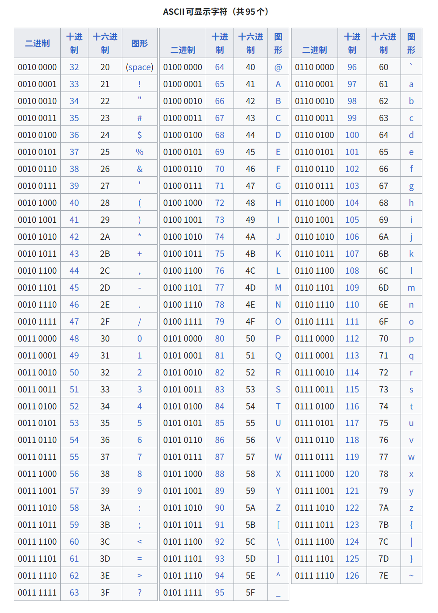
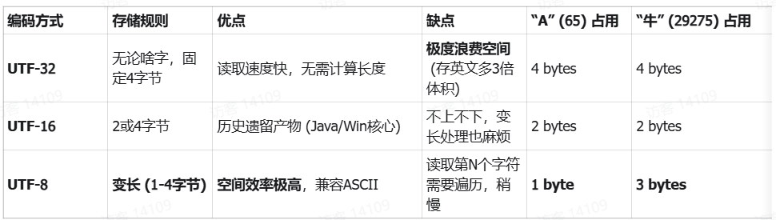
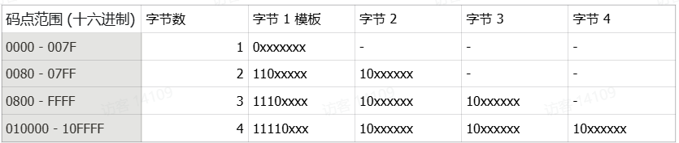

&emsp;&emsp;[**CS336**](https://cs336.stanford.edu/)的学习笔记，参考了b站[**这就是小C_**](https://space.bilibili.com/488678545/)的视频和笔记。

### 文本编码与Tokenizer

#### 字符本质：ASCII、Unicode与UTF-8编码

&emsp;&emsp;计算机为了使用二进制唯一标识某个字符，必须先有**字符—>数字**的映射表，[**ASCII**](https://zh.wikipedia.org/wiki/ASCII#)（American Standard Code for Information Interchange，美国信息交换标准代码）是早年的一套编码标准，它定义了26个基本拉丁字母、阿拉伯数字和英式标点符号的对应二进制编码。ASCII码只能用于现代美国英语，对于其它语言例如中文无能为力，为了解决这样的局限，Unicode产生。



&emsp;&emsp;[**Unicode**](https://zh.wikipedia.org/wiki/%E7%BB%9F%E4%B8%80%E7%A0%81#)（The Unicode Standard）也称作统一码、万国码，它在兼容ASCII的基础上为全球的所有字符包括emoji分配了一个唯一的ID，也称为**码点**，例如“A"对应十进制数65，”牛“对应0x725B。

&emsp;&emsp;解决了编号问题，还需要解决的问题是这个码点如何存储在内存中，转换为二进制后，数据长短不一，使用多少字节存储和计算机如何识别就是UTF解决的问题。UTF（Unicode Transformation Format）意为Unicode转换格式，最常用的是UTF-8，它使用了变长前缀编码方式，原理类似于计算机网络中划分子网的方式。



&emsp;&emsp;UTF-8通过**控制位**和**延续位**判断该字符占几个字节以及当前字节是否是开头，例如110开头表示后面还有一个字节，10开头表示当前字节是一个“从属字节”。



&emsp;&emsp;示例：以emoji👍为例，👍的码点是128077，对应的十六进制为0x1F44D，二进制为0001 1111 0100 0100 1101。

​	&emsp;&emsp;0x1F44D对应4字节模版:

&emsp;&emsp;	1111 0**xxx** | 10**xx xxxx** | 10**xx xxxx** | 10**xx xxxx**

&emsp;&emsp;	将码点转换后的二进制填充后得出结果（从后往前，有空填0）:

​	&emsp;&emsp;1111 0**000** | 10**01 1111** | 10**01 0001** | 10**00 1101**

​	&emsp;&emsp;最后的结果即为F0 9F 91 8D

```python
>>> print(ord('👍'))
128077
>>> print(hex(128077))
0x1f44d
>>> print(bin(128077))
0b11111010001001101
>>> print('👍'.encode('utf-8'))
b'\xf0\x9f\x91\x8d'
```

#### BPE算法原理与训练实现
