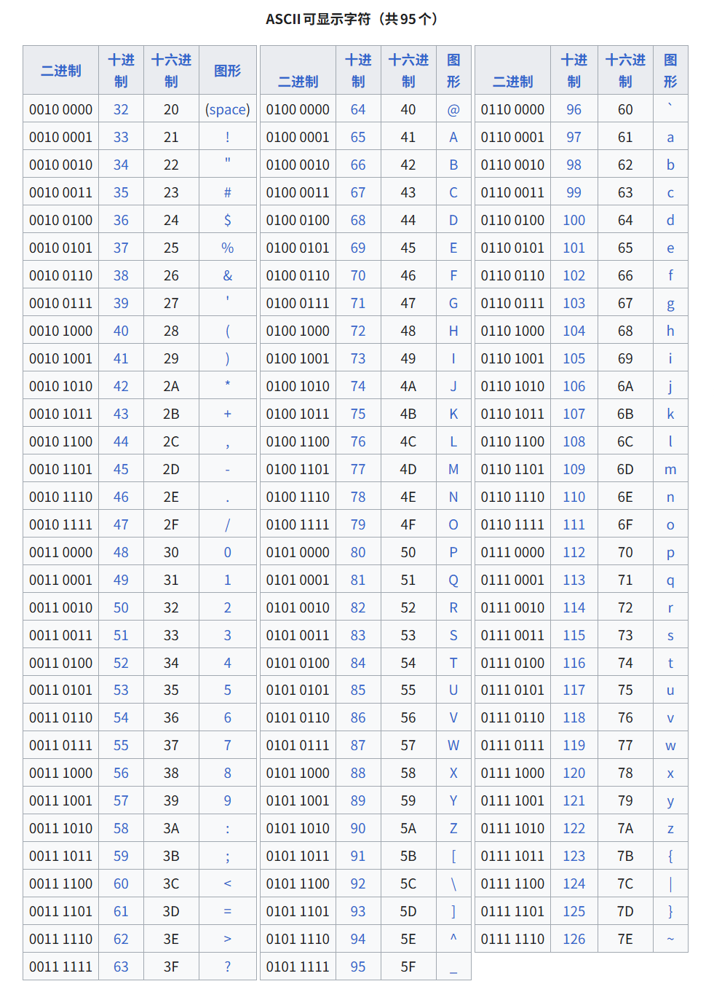
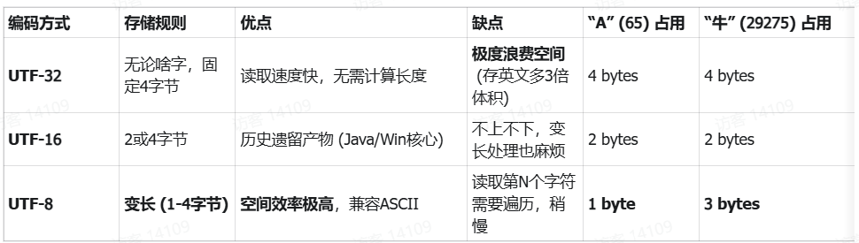
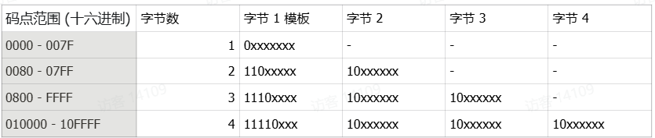

&emsp;&emsp;[CS336](https://cs336.stanford.edu/)的学习笔记，参考了b站[这就是小C_](https://space.bilibili.com/488678545/)的视频和笔记。

### 文本编码与Tokenizer

#### 字符本质：ASCII、Unicode与UTF-8编码

&emsp;&emsp;计算机为了使用二进制唯一标识某个字符，必须先有**字符 -> 数字**的映射表，[ASCII](https://zh.wikipedia.org/wiki/ASCII#)（American Standard Code for Information Interchange，美国信息交换标准代码）是早年的一套编码标准，它定义了26个基本拉丁字母、阿拉伯数字和英式标点符号的对应二进制编码。ASCII码只能用于现代美国英语，对于其它语言例如中文无能为力，为了解决这样的局限，Unicode产生。



&emsp;&emsp;[Unicode](https://zh.wikipedia.org/wiki/%E7%BB%9F%E4%B8%80%E7%A0%81#)（The Unicode Standard）也称作统一码、万国码，它在兼容ASCII的基础上为全球的所有字符包括emoji分配了一个唯一的ID，也称为**码点**，例如“A”对应十进制数`65`，“牛”对应`0x725B`。

&emsp;&emsp;解决了编号问题，还需要解决的问题是这个码点如何存储在内存中，转换为二进制后，数据长短不一，使用多少字节存储和计算机如何识别就是UTF解决的问题。UTF（Unicode Transformation Format）意为Unicode转换格式，最常用的是UTF-8，它使用了变长前缀编码方式，原理类似于计算机网络中划分子网的方式。



&emsp;&emsp;UTF-8通过**控制位**和**延续位**判断该字符占几个字节以及当前字节是否是开头，例如110开头表示后面还有一个字节，10开头表示当前字节是一个“从属字节”。



&emsp;&emsp;示例：以emoji👍为例，👍的码点是`128077`，对应的十六进制为`0x1F44D`，二进制为`0001 1111 0100 0100 1101`。

&emsp;&emsp;`0x1F44D`对应4字节模版：

&emsp;&emsp;1111 0`xxx` | 10`xx xxxx` | 10`xx xxxx` | 10`xx xxxx`

&emsp;&emsp;将码点转换后的二进制填充后得出结果（从后往前，有空填0）：

&emsp;&emsp;1111 0`000` | 10`01 1111` | 10`01 0001` | 10`00 1101`

&emsp;&emsp;最后的结果即为`F0 9F 91 8D`。

```python
>>> print(ord('👍'))
128077
>>> print(hex(128077))
0x1f44d
>>> print(bin(128077))
0b11111010001001101
>>> print('👍'.encode('utf-8'))
b'\xf0\x9f\x91\x8d'
```

### BPE算法原理与训练实现

&emsp;&emsp;本节主要围绕两个目标展开：一是理解BPE（Byte-Pair Encoding）的算法思想，二是不依赖`transformers`等现成库，亲手实现并训练一个基于BPE的分词器。

#### 为什么需要Tokenizer

&emsp;&emsp;一个直观的问题是：既然`UTF-8`已经能把所有文本编码成`0~255`范围内的字节，为什么不能直接把原始字节丢给模型？核心原因是序列长度会变得过长。Transformer的`Self-Attention`计算复杂度与序列长度的平方相关，如果直接以字节作为输入单位，文本会被切得非常碎，计算量和显存占用都会明显上升。

&emsp;&emsp;例如单词`Transformer`本身占用`11`个字节。如果以字节为单位输入，序列长度就是`11`；如果它能够作为一个整体Token输入，序列长度就可以压缩为`1`。Tokenizer的本质作用，就是在**词表大小**和**序列长度**之间寻找平衡：把高频、稳定的字节组合打包成一个Token，从而减少模型实际看到的序列长度。

&emsp;&emsp;BPE是Tokenizer的一种主流实现方式。它不依赖人工词典，而是通过统计语料中相邻符号对的出现频率，反复合并最常见的符号对，让常见片段逐渐形成更长的Token。这样既保留了从字节出发的开放词表能力，也能对常见文本片段进行压缩。

#### BPE流程

&emsp;&emsp;BPE（Byte-Pair Encoding）的核心思想可以概括为一句话：**从最小的符号单位开始，每次找到当前语料中出现频率最高的相邻符号对，并把它们合并成一个新的Token**。不断重复这个过程后，常见的文本片段会逐渐被压缩成更长的Token，而低频词、生僻词、新词仍然可以退回到更小的子词甚至字节表示。

&emsp;&emsp;训练流程通常如下：

1. **初始化基础词表**

&emsp;&emsp;先把`0~255`这`256`个字节放进基础词表。由于所有`UTF-8`文本最终都可以表示成字节序列（单字节或多字节），因此这种做法天然具备开放词表能力：无论是中文、英文、emoji、代码符号还是生僻字符，都能被编码，不会因为遇到未知字符而无法处理。

2. **处理特殊Token**

&emsp;&emsp;在正式训练之前，需要先确定是否存在特殊Token，例如：

```text
<|endoftext|>
<|pad|>
<|bos|>
<|eos|>
```

&emsp;&emsp;这些Token不是普通文本，而是带有**控制语义**的标记。例如`<|endoftext|>`可以表示一段文本结束，`<|pad|>`可以用于补齐序列长度，`<|bos|>`和`<|eos|>`可以表示序列开始和结束。训练时必须把它们从普通语料中隔离出来，避免BPE把它们拆成零散片段，或者让它们和普通文本一起参与频率统计。训练完成后，再把这些特殊Token作为完整Token加入词表。

&emsp;&emsp;一些领域内具有稳定含义的专业名词，也可以根据任务需要进行类似处理。例如医学文本中的`BRCA1`、`COVID-19`，代码语料中的`torch.nn.Module`、`std::vector`，论文语料中的`Self-Attention`、`LayerNorm`等。如果这些词在任务中非常重要，并且希望模型把它们视为一个完整单元，就可以考虑将它们加入特殊Token或通过规则保护起来。不过特殊Token会占用词表空间，加入过多反而会削弱Tokenizer的通用性，因此一般只保留真正需要稳定表示的控制符号或高价值领域词。

3. **预分词（Pre-tokenization）**

&emsp;&emsp;在真正统计字节对频率之前，通常需要先做预分词。预分词会根据一组规则先把输入文本切成若干片段，避免BPE在不合适的边界上跨片段合并，产生违背直觉的Token。

&emsp;&emsp;例如不做预分词时，`"您好 人没了"`有可能被切成`"您"`、`"好 人"`、`"没了"`，其中`"好 人"`跨过了空格边界，语义和形式上都不自然。先按空格等规则预分词后，可以得到`"您好"`和`"人没了"`两个片段，再分别在片段内部继续分词，例如得到`"您好"`、`"人"`、`"没了"`，这样可以更好地约束Token边界。

&emsp;&emsp;GPT-2风格的Tokenizer通常会使用正则表达式进行预分词，把文本拆成字母串、数字串、标点、空白符等片段，并且常常把单词前面的空格和单词绑定在一起。例如：

```text
Hello World test!
```

&emsp;&emsp;可能会被预分词为：

```text
["Hello", " World", " test", "!"]
```

&emsp;&emsp;这一步不会产生最终Token，而是给后续BPE合并划定边界。也就是说，BPE只在预分词得到的片段内部统计和合并，不会随意跨越片段边界。

4. **统计相邻符号对频率**

&emsp;&emsp;预分词之后，每个片段会被转换成`UTF-8`字节序列。然后统计语料中所有相邻符号对的出现频率。例如当前有如下片段：

```text
t h e
t h e
t h a t
```

&emsp;&emsp;那么`(t, h)`出现`3`次，`(h, e)`出现`2`次，`(h, a)`出现`1`次，`(a, t)`出现`1`次。这里的频率统计会考虑片段在语料中的出现次数，出现越多的片段，对全局统计的影响越大。

5. **合并最高频Pair**

&emsp;&emsp;每一轮训练都会选择当前出现频率最高的相邻符号对，并把它合并成一个新Token。例如`(t, h)`最高频，就把它合并为`th`：

```text
t h e   -> th e
t h e   -> th e
t h a t -> th a t
```

&emsp;&emsp;合并后，原来的符号序列发生变化，新的相邻符号对也会随之产生。因此BPE会继续在更新后的语料表示上统计`pair`频率，并进行下一轮合并。

6. **重复直到达到目标词表大小**

&emsp;&emsp;BPE会不断重复“统计`pair`频率 -> 选择最高频`pair` -> 合并为新Token”的过程，直到词表大小达到预设值，或者已经没有可以继续合并的`pair`。训练结束后，会得到两个核心结果：

&emsp;&emsp;一是`vocab`，也就是**Token ID到字节序列的映射**；二是`merges`，也就是**按训练顺序记录下来的合并规则**。后续编码新文本时，不再重新统计频率，而是按照`merges`中的优先级应用这些合并规则。

&emsp;&emsp;总体来看，BPE本质上是一种数据驱动的文本压缩算法：常见片段被合并成更长的Token，从而缩短序列长度；不常见片段则保留为更细粒度的子词或字节，从而保证任何文本都可以被表示。

#### 示例

&emsp;&emsp;沿用前面的极简例子，假设预分词后的片段是：

```text
the
the
that
```

&emsp;&emsp;为了方便观察，这里暂时用字符来表示对应的单字节。实际的Byte-level BPE中，它们都会先被表示成`UTF-8`字节序列：

```text
the  -> t h e
the  -> t h e
that -> t h a t
```

&emsp;&emsp;初始`vocab`包含全部`0~255`个单字节Token，其中一小部分可以写成：

```text
ID 97  -> b"a"
ID 101 -> b"e"
ID 104 -> b"h"
ID 116 -> b"t"
```

&emsp;&emsp;第一轮统计相邻`pair`频率：

```text
the  : (t, h), (h, e)
the  : (t, h), (h, e)
that : (t, h), (h, a), (a, t)
```

&emsp;&emsp;因此：

```text
(t, h) 出现 3 次
(h, e) 出现 2 次
(h, a) 出现 1 次
(a, t) 出现 1 次
```

&emsp;&emsp;最高频`pair`是`(t, h)`，于是第一条合并规则就是：

```text
(b"t", b"h") -> b"th"
```

&emsp;&emsp;这条规则会被记录进`merges`：

```text
merges = [
  (b"t", b"h")
]
```

&emsp;&emsp;同时`vocab`中新增一个Token，例如：

```text
ID 256 -> b"th"
```

&emsp;&emsp;语料表示随之更新为：

```text
the  -> th e
the  -> th e
that -> th a t
```

&emsp;&emsp;第二轮重新统计`pair`。此时：

```text
(th, e) 出现 2 次
(th, a) 出现 1 次
(a, t)  出现 1 次
```

&emsp;&emsp;最高频`pair`是`(th, e)`，于是继续合并：

```text
(b"th", b"e") -> b"the"
```

&emsp;&emsp;此时`merges`变成：

```text
merges = [
  (b"t", b"h"),
  (b"th", b"e")
]
```

&emsp;&emsp;`vocab`继续新增：

```text
ID 257 -> b"the"
```

&emsp;&emsp;语料表示更新为：

```text
the  -> the
the  -> the
that -> th a t
```

&emsp;&emsp;如果继续训练，下一轮可能会把`(th, a)`合并为`tha`，再把`(tha, t)`合并为`that`。这样最终`vocab`的一部分可能长这样：

```text
ID 97  -> b"a"
ID 101 -> b"e"
ID 104 -> b"h"
ID 116 -> b"t"
ID 256 -> b"th"
ID 257 -> b"the"
ID 258 -> b"tha"
ID 259 -> b"that"
```

&emsp;&emsp;对应的`merges`可能是：

```text
(b"t", b"h")    -> b"th"
(b"th", b"e")   -> b"the"
(b"th", b"a")   -> b"tha"
(b"tha", b"t")  -> b"that"
```

&emsp;&emsp;可以看到，`vocab`和`merges`关注的是两个不同问题：

&emsp;&emsp;`vocab`回答的是：**某个Token ID对应什么字节序列**。例如`ID 257 -> b"the"`。

&emsp;&emsp;`merges`回答的是：**编码新文本时应该按照什么顺序合并字节或子词**。例如先把`b"t"`和`b"h"`合并成`b"th"`，再把`b"th"`和`b"e"`合并成`b"the"`。

&emsp;&emsp;例如编码新文本`the`时，初始表示是：

```text
t h e
```

&emsp;&emsp;按照`merges`中的规则依次合并：

```text
t h e
-> th e
-> the
```

&emsp;&emsp;最后再查`vocab`，就可以得到：

```text
the -> ID 257
```

&emsp;&emsp;如果编码`that`，初始表示是：

```text
t h a t
```

&emsp;&emsp;按照上面的合并规则，可以得到：

```text
t h a t
-> th a t
-> tha t
-> that
```

&emsp;&emsp;最后得到：

```text
that -> ID 259
```

&emsp;&emsp;如果某个词没有被完整合并成一个Token，也没有关系。BPE会使用已经学到的最长可用片段进行表示；如果连子词都匹配不上，也可以退回到底层字节Token。这就是Byte-level BPE既能压缩常见文本，又能覆盖任意UTF-8文本的原因。

#### 代码

```python
import os
from collections import defaultdict, Counter
import regex as re  # type: ignore
import json


def train_bpe(
    input_path: str | os.PathLike,  # 输入语料文件的路径
    vocab_size: int,             # 目标词表大小（基础字节 + 合并 Token + 特殊 Token）
    special_tokens: list[str],   # 需要保留的特殊 Token 列表
) -> tuple[dict[int, bytes], list[tuple[bytes, bytes]]]:
    """
    训练字节级 BPE (Byte-Pair Encoding) 分词器。
    
    该函数 BPE 算法的核心流程：
    1. 初始化词表为所有可能的字节 (0-255)。
    2.  读取输入语料，并根据特殊 Token 进行切分，确保特殊 Token 不参与统计。
    3. 使用 GPT-2 的预分词正则将语料库切分成单词，并统计每个单词的频率。
    4. 迭代进行“合并”操作，直到达到目标词表大小。
       - 合并策略：总是选择当前出现频率最高、且在字典序上最大的字节对。
    5. 使用倒排索引优化合并过程中的频率更新，确保速度。
    6. 将合并产生的 Token 加入词表，并最终加入特殊 Token。
    
    返回:
        tuple[dict[int, bytes], list[tuple[bytes, bytes]]]:
            vocab: 训练好的词汇表，映射 Token ID -> Token 字节序列。
            merges: BPE 合并规则列表，按生成顺序排列。
    """
    
    # --- 1. 初始化基础词表 ---
    # 词表从 0 到 255 的字节开始，这是 BPE 的基础单位。
    vocab = {i: bytes([i]) for i in range(256)}
    
    # 计算需要进行的合并次数。
    # 目标词表大小 = 基础字节数 (256) + 特殊 Token 数 + 需要新生成的 Token 数。
    num_merges = vocab_size - 256 - len(special_tokens)
    
    # --- 2. 读取语料，并按特殊 Token 分割 ---
    with open(input_path, "r", encoding="utf-8") as f:
        text = f.read()

    # 如果指定了特殊 Token，我们需要在开始统计之前将它们从语料中“隔离”出来。
    # 这能防止 BPE 规则将特殊 Token（如 <|endoftext|>）拆开或与普通文本混合。

    """
    For special_tokens:
    在训练时，必须保证特殊 Token 不参与频率统计。
    代码逻辑：
        切割语料：在开始统计词频之前，利用正则将语料库在特殊 Token 处切开。
        独立统计：只对切分出来的普通文本片段进行 BPE 统计。
        最后加入：训练结束后，强制将特殊 Token 加入词表（通常放在最后），确保它们有 ID。
    """
    if special_tokens:
        # 在正则中，| 表示“或”，这行代码将多个特殊 token 用 | 连接，形成一个匹配任一 token 的正则模式。
        special_regex = "|".join(re.escape(t) for t in special_tokens)
        # 使用 re.split 进行分割。关键是使用捕获组 `(...)`，这样特殊 Token 本身也会被保留在结果列表中。
        parts = re.split(f"({special_regex})", text)
        # 过滤掉从 parts 中提取出的特殊 Token 本身，只保留用于 BPE 训练的普通文本片段。
        # text = "Hello World World<|endoftext|>Hello happy happy<|endoftext|>!"
        # train_segments =  ['Hello World World', 'Hello happy happy', '!']
        train_segments = [p for p in parts if p not in special_tokens]
    else:
        # 如果没有特殊 Token，直接使用整个语料。
        train_segments = [text]

    # --- 3. 预分词（Pre-tokenization）并统计词频 ---
    # 使用 GPT-2 的 BPE 预分词正则表达式。
    # GPT-2 正则表达式的作用是执行“预分词（Pre-tokenization）”。 它的规则是：
    #   (1)不允许跨越类型合并：比如它会把字母和标点符号分开。
    #   (2)保护空格：它通常会把单词前面的空格和单词连在一起，作为一个整体。
    # text = "Hello World test! ..."
    # 分割后 words = ['Hello', ' World', ' test', '!', ' ...']
    gpt2_pat = re.compile(r"""'(?:[sdmt]|ll|ve|re)| ?\p{L}+| ?\p{N}+| ?[^\s\p{L}\p{N}]+|\s+(?!\S)|\s+""")
    
    # raw_counts: 存储每个“单词”（预分词后的结果）及其出现频率。
    # 单词被表示为字节元组，例如 "hello" -> (b'h', b'e', b'l', b'l', b'o')
    raw_counts = Counter()
    for segment in train_segments:
        # 对每个语料片段应用预分词正则，找到所有“单词”
        words = gpt2_pat.findall(segment)
        for word in words:
            # 将单词转换为 UTF-8 字节序列，然后组成元组作为 Counter 的键, 统计这个元组出现的频次
            """
            对于 "Hi"：
                word.encode("utf-8") 得到 b'Hi'。
                for b in b'Hi' 会遍历出整数 72 和 105。
                bytes([b]) 把整数变回单字节对象：b'H' 和 b'i'。
                最终组成元组：(b'H', b'i')。
            为什么必须是元组（tuple）？
                因为 Counter 的键（key）必须是不可变的。list 不能做键，而 tuple 可以。

            举例：
                raw_counts = {
                    (b'H', b'i'): 50,
                    (b' ', b't', b'h', b'e', b'r', b'e'): 100,
                    (b'!'): 50,
                    (b'\xe4',b'\xbd',b'\xa0',b'\xe5',b'\xa5',b'\xbd'):20, # 你好
                }
            """
            raw_counts[tuple(bytes([b]) for b in word.encode("utf-8"))] += 1
            
    # --- 构建高效数据结构以支持快速合并 ---
    # words_list: 存储每个单词的字节列表。使用 list 而不是 tuple，因为 BPE 合并会修改单词内部结构。
    # counts_list: 存储对应单词的频率。
    words_list = []
    counts_list = []
    for word_tuple, freq in raw_counts.items():
        words_list.append(list(word_tuple)) # 转换为 list 以便后面修改
        counts_list.append(freq)

    # defaultdict(int) 是一个“带默认初始值”的字典。当你访问一个字典中不存在的键时，它不会报错，而是自动为这个键创建一个默认值 0，而在使用普通字典进行计数时，你必须先检查键是否存在，否则会触发 KeyError。
    # stats: 存储所有可能的相邻字节对 (pair) 及其全局出现频率。
    # 结构：{(byte_a, byte_b): frequency}
    stats = defaultdict(int)
    
    # indices: 倒排索引。存储 pair -> {包含该 pair 的单词在 words_list 中的下标集合}
    # 这个结构是性能优化的关键，用于快速找到需要更新的单词。
    indices = defaultdict(set)
    
    # --- 初始化 `stats` 和 `indices` ---
    # 遍历所有唯一的单词
    for idx, word in enumerate(words_list):
        freq = counts_list[idx] # 获取该单词的出现频率
        # 遍历单词中的所有相邻字节对
        for i in range(len(word) - 1):
            pair = (word[i], word[i+1])
            stats[pair] += freq          # 累加该 pair 的全局频率
            indices[pair].add(idx)       # 将当前单词的索引加入该 pair 的倒排列表中
            
    merges = [] # 用于存储生成的 BPE 合并规则，按顺序记录

    # --- 4. 迭代合并流程 ---
    # 循环执行 `num_merges` 次，每次找到并应用一个最佳合并规则
    for _ in range(num_merges):
        # 如果 `stats` 为空（所有可能的对都已合并或频率为0），则停止
        if not stats:
            break
            
        # --- 4a. 寻找最佳 Pair ---
        # 目标：找到当前 `stats` 中频率最高、且字典序最大的 Pair
        # `max(stats.items(), key=lambda x: (x[1], x[0]))` 
        #   - x[1] 是频率 (frequency)。max 会优先选择大的频率。
        #   - x[0] 是 Pair (tuple of bytes)。如果频率相同，max 会比较 Pair 的字典序。
        #     Python 对元组的比较是逐个元素进行，所以 `(b' ', b't')` 会大于 `(b' ', b'a')`。
        best_pair = max(stats.items(), key=lambda x: (x[1], x[0]))[0]
        
        # 如果最佳 Pair 的频率已经降到 0（可能是在之前的迭代中由于其组成部分被合并了），则停止
        if stats[best_pair] <= 0:
            break
            
        # 记录这次合并
        merges.append(best_pair)
        # 创建新的 Token（合并后的字节序列）
        new_token = best_pair[0] + best_pair[1]
        
        # --- 4b. 获取需要更新的单词 ---
        # 使用倒排索引 `indices`，快速获取所有包含 `best_pair` 的单词的下标
        # 必须复制一份 `relevant_indices`，因为后面的循环会修改 `indices` 和 `stats`
        relevant_indices = list(indices[best_pair])
        
        # --- 4c. 遍历并更新所有受影响的单词、统计信息和倒排索引 ---
        for idx in relevant_indices:
            word = words_list[idx] # 获取单词
            freq = counts_list[idx] # 获取单词的频率
            
            # 扫描当前单词，找到所有 `best_pair` 的出现位置
            i = 0
            while i < len(word) - 1:
                # 检查当前位置 `i` 和 `i+1` 是否匹配 `best_pair`
                if word[i] == best_pair[0] and word[i+1] == best_pair[1]:
                    # --- 匹配到 `best_pair`，执行合并 ---
                    
                    # 1. 更新旧的邻居 Pair 的频率：
                    #    - 左邻居：(word[i-1], word[i])
                    if i > 0:
                        prev_pair = (word[i-1], word[i])
                        stats[prev_pair] -= freq # 频率减去该单词的频率
                        if stats[prev_pair] == 0:
                            # 如果频率降为 0，从 `stats` 中移除该 pair，避免未来错误选择
                            """
                            stats 字典里依然会存在这个键：{(b'x', b'y'): 0}。
                            当训练快结束，或者剩下的所有对频率都降为 0 时，max 函数依然会扫描这些值为 0 的项。
                            根据平局规则，如果存在多个频率为 0 的项，max 会返回其中字典序最大的那一个，这是错误的
                            """
                            del stats[prev_pair]
                        # 不从 indices 中移除 idx
                        # 因为我们后续会通过检查 `word[i]` 来确定是否真的匹配。
                        # 频繁移除索引反而可能导致性能下降或逻辑错误。
                        
                    #    - 右邻居：(word[i+1], word[i+2])
                    if i < len(word) - 2:
                        next_pair = (word[i+1], word[i+2])
                        stats[next_pair] -= freq
                        if stats[next_pair] == 0:
                            del stats[next_pair]
                      
                    
                    # 2. 修改单词结构：将 (word[i], word[i+1]) 替换为 new_token
                    word[i] = new_token     # 将第一个字节替换为新 Token
                    del word[i+1]           # 删除第二个字节，使单词变短
                    
                    # 3. 添加新产生的邻居 Pair 的频率和索引
                    #    - 新的左邻居：(word[i-1], new_token)
                    if i > 0:
                        new_prev = (word[i-1], word[i]) # word[i] 现在是 new_token
                        stats[new_prev] += freq
                        indices[new_prev].add(idx) # 添加到新 pair 的倒排索引
                    
                    #    - 新的右邻居：(new_token, word[i+1]) (注意：word[i+1] 是旧的 word[i+2])
                    if i < len(word) - 1:
                        new_next = (word[i], word[i+1])
                        stats[new_next] += freq
                        indices[new_next].add(idx)
                    
                    # 合并后，索引 i 指向的是新 Token。
                    # i 不需要移动（i+=1），因为我们刚刚修改了 word[i] 并且删除了 word[i+1]。
                    # 下一轮循环会检查新的 (word[i], word[i+1])，即 (new_token, old_word[i+2])
                    # 这可以处理像 A A A -> X A 这样的情况，正确地更新新的邻居对
                else:
                    # 如果不匹配，正常移动到下一个位置
                    i += 1
        
        # 4d. 清理：移除已完全合并的 `best_pair`
        # 这个 pair 已经不存在于 `stats` 和 `indices` 中了
        if best_pair in stats: del stats[best_pair]
        if best_pair in indices: del indices[best_pair]

    # --- 5. 构建最终的词表 ---
    # 添加 BPE 合并产生的 Token，ID 从 256 开始，按合并顺序递增
    for pair in merges:
        new_id = len(vocab)
        vocab[new_id] = pair[0] + pair[1]
        
    # 添加特殊 Token
    for s_tok in special_tokens:
        s_bytes = s_tok.encode("utf-8")
        vocab[len(vocab)] = s_bytes

    return vocab, merges


def bytes_to_unicode():
    """
    创建一个映射，将 0-255 字节映射为一组可见的 Unicode 字符。
    这是 GPT-2 源码中的标准做法。
    """
    bs = list(range(ord("!"), ord("~") + 1)) + list(range(ord("¡"), ord("¬") + 1)) + list(range(ord("®"), ord("ÿ") + 1))
    cs = bs[:]
    n = 0
    for b in range(256):
        if b not in bs:
            bs.append(b)
            cs.append(256 + n)
            n += 1
    cs = [chr(n) for n in cs]
    return dict(zip(bs, cs))


def save_tokenizer_files(vocab, merges, out_dir):
    os.makedirs(out_dir, exist_ok=True)

    # 初始化映射表
    byte_encoder = bytes_to_unicode()

    # 词表保存
    # 使用 byte_encoder 将 bytes 转换为可见字符串
    json_vocab = {
        k: "".join(byte_encoder[b] for b in v) 
        for k, v in vocab.items()
    }
    with open(os.path.join(out_dir, "vocab.json"), "w", encoding="utf-8") as f:
        json.dump(json_vocab, f, indent=4)
    
    # 合并规则保存
    with open(os.path.join(out_dir, "merges.txt"), "w", encoding="utf-8") as f:
        for p1, p2 in merges:
            # 同样转换 p1 和 p2
            s1 = "".join(byte_encoder[b] for b in p1)
            s2 = "".join(byte_encoder[b] for b in p2)
            f.write(f"{s1} {s2}\n")

def main():
    input_path = "data/TinyStoriesV2-GPT4-train.txt" # 你的原始文本路径
    vocab_size = 10000 # 作业要求的词表大小
    # input_path = "data/owt_train.txt" 
    # input_path = "data/chinese.txt" 
    # vocab_size = 1000 # 作业要求的词表大小
    
    special_tokens = ["<|endoftext|>"]
    output_dir = "data/TinyStoriesV2-GPT4-train"

    print(f"开始训练 BPE 分词器 (目标词表大小: {vocab_size})...")
    print("这可能需要几分钟，具体取决于你的 CPU 速度和倒排索引的效率。")
    
    # 调用你之前写好的逻辑
    vocab, merges = train_bpe(input_path, vocab_size, special_tokens)
    
    # 保存结果
    save_tokenizer_files(vocab, merges, output_dir)

if __name__ == "__main__":
    main()
```

