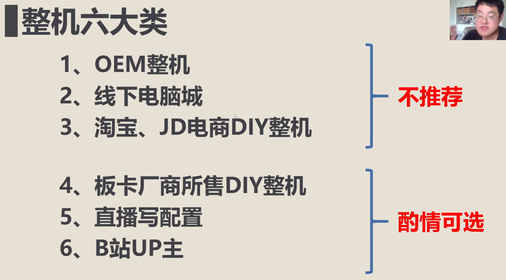
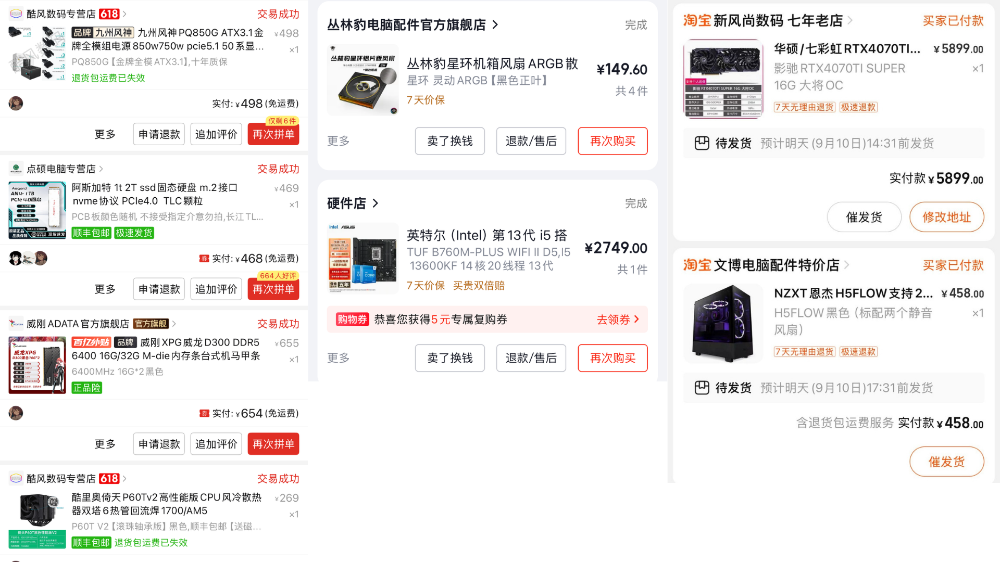
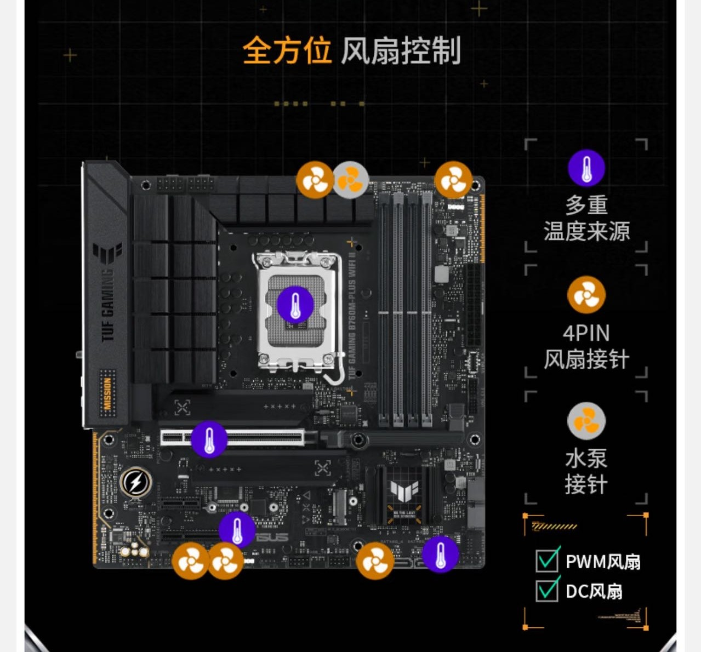

&emsp;&emsp;有DIY装机的想法一是因为上大学时买的轻薄全能本玩不了一些游戏，二是因为当时大二分流进入了计算机专业，宿舍从狭窄的五人寝室换到了四人上床下桌，有足够地方放主机。两个室友都有装机的经验，主机+笔记本兼顾性能便携的体验感觉不赖，所以在24年9月的时候我花钱找人写配置，自己购买了配件组装了主机。分享一些选择、组装前后的问题和经验，不过现在的内存大大涨价，好像甚至到了原本的两倍😨，不推荐这个时候装机，

### 装机选择

&emsp;&emsp;装机大体上有两个选择，整机和DIY组装。整机是一些品牌或商家根据不同价格档位给出配置组合，优点是省事，整机装好后发货，一般只需要安装显卡，系统安装测试等都由商家完成，有售后服务；缺点是配置自由度低，其中的配件可能有杂牌或库存，整机的选择可以参考[**小白购买DIY整机到底去哪买？应该怎么买？六大整机渠道汇总解析**](https://www.bilibili.com/video/BV1AN411C7CV/)。

&emsp;&emsp;DIY组装是自己确定配置购买配件组装，优点是性价比高，自由选择配件，缺点是没有售后，购买配件组装整个周期比较长，自己组装还需要安装系统测试等。我的选择是付费找人写配置 + 自购配件 + 自己装机，我比较推荐这种方式。因为对于大多数人来说，短时间不太能了解各个硬件是否兼容、不同品牌的性价比、市场，也没必要深入了解，找人写配置可以省去很多时间精力，也能满足自己的需求，如果嫌安装麻烦可以找人上门组装或寄件代组装。我是在淘宝上[**juexi的配置工坊**](https://shop541477570.taobao.com/)定制的配置和推荐链接，找人写配置前可以先[**确认需求预算**](https://www.bilibili.com/video/BV1vH4y1E7ej/)：比如需要玩什么游戏，是否有生产力需求例如渲染剪辑或代码工作，是否要n卡，外观颜色，有没有喜欢的某个机箱或者尺寸要求等等......

### 购买配件和组装

&emsp;&emsp;换了个机箱和RGB风扇，用上面juexi推荐的商家链接购买了所有的配件，买风扇时需要注意正叶反叶，固态的话如果用来打游戏建议可以2T以上，我后面感觉不够用再加装了1T。

&emsp;&emsp;组装前还需要提前准备安装系统的空u盘，螺丝刀，理线用的扎带。除此之外可以提前查看主板是否有足够的RGB接口、风扇接口，可以购买集线器用来统一调整灯效转速，也能更整洁。

&emsp;&emsp;安装的教程可以看硬件茶谈的[**【装机教程】全网最好的装机教程，没有之一**](https://www.bilibili.com/video/BV1BG4y137mG/)，再看一些相同机箱别人的装机理线视频就行了，实际第一次上手装还是有点慌的，在室友指导下从下午装到了晚上，因为是大机箱所以安装还是比较简单的，理线虽然很乱但盖上后板反正就看不到了。第一次竟然成功点亮了，但是内存没按牢重新拆开又装了一遍（风冷是真的割手😓）,解决内存的问题后仍然显示器没反应，没招了只好第二天请了个装机师傅上门检查了一遍，拆开了一部分重装就成功了。后续使用的时候仍然有小毛病，有几次电脑睡眠后就开不了机了，一开始以为是静电问题，拆装主板电池就又能开机了，直到放假的时候搬回家把主板的供电线拔插了一下才彻底解决（所以如果不想体验组装流程直接请人上门装比较方便）。

&emsp;&emsp;装系统、驱动还有烤机可以参考以下的视频：

- [**【装机教程】超详细WIN10系统安装教程，官方ISO直装与PE两种方法教程，UEFI+GUID分区与Legacy+MBR分区**](https://www.bilibili.com/video/BV1DJ411D79y)

- [**装机不求人之：史上最全传说级装系统教程，零基础新手一站式WIN10系统安装攻略。内含系统激活、驱动安装、BIOS基础调试及基础烤机稳定性压力测试。**](https://www.bilibili.com/video/BV1UP4y1L7io)
- [**全网最细！验机烤机软件一站式教程，新手装机必学必用的10款基础检测烤机跑分软件！【天才赵德柱】**](https://www.bilibili.com/video/BV1sD421A74F)

### 装机之后

&emsp;&emsp;装机之后为了在上课或者回家时远控主机，折腾了很久，首先是远程控制软件，校园网下尝试过比如向日葵，parsec，sunshine+moonlight等，当时体验最流畅的是[**parsec**](https://parsec.app/)，目前国内的[**uu远程**](https://uuyc.163.com/)体验也比较好，功能很全。

&emsp;&emsp;为了在校园网环境下远程开关机，一开始买了向日葵的智能插座，在bios设置中设置开机自启，但是蓝牙插座意味着至少在宿舍需要一个联网设备，所以又换了一个4G智能插座。uu远程现在也内置了远程开机功能，可以尝试一下。其他的方式有购买开机卡，物理开关控制等等。

&emsp;&emsp;解决完远程开机，但是学校的校园网需要登录，有时候还会踢人🥲，我的解决方式是写了个脚本开机定时登录校园网，还有一些别人的方法比如通过使用软路由认证校园网等等。

### 
