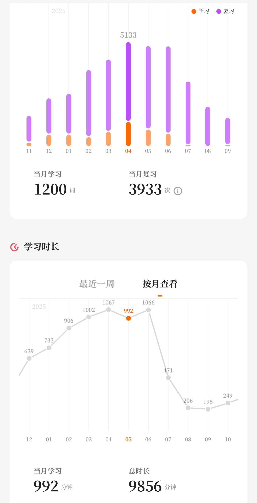
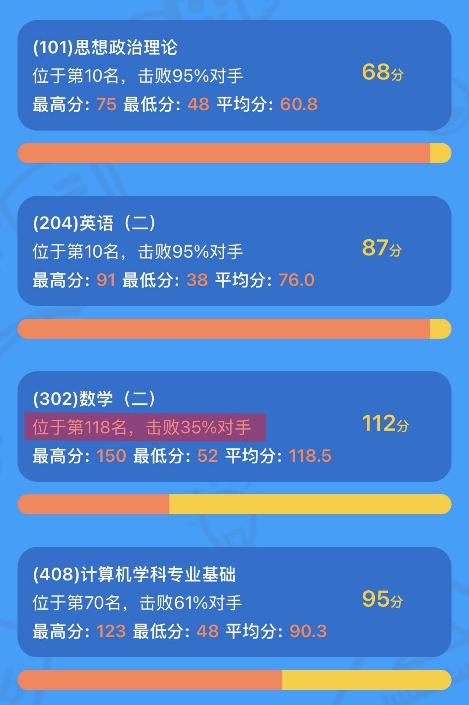
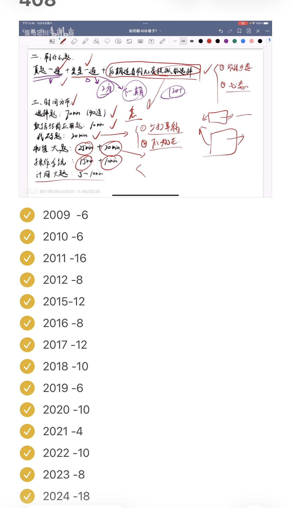
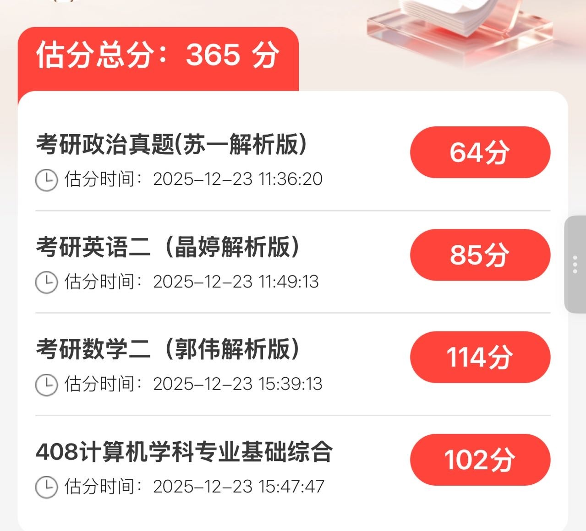
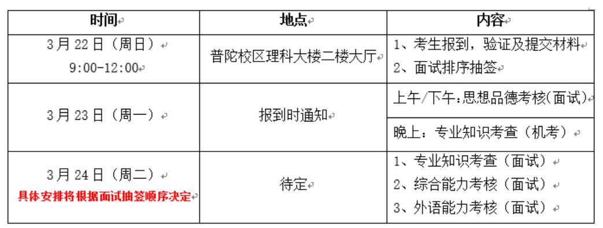
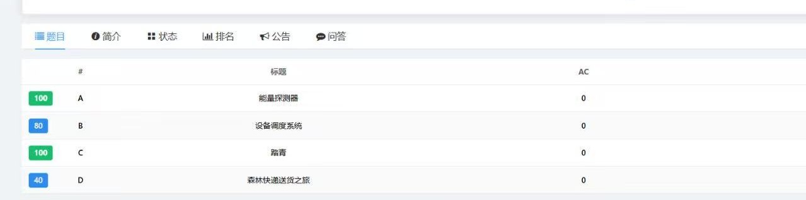

&emsp;&emsp;在三月底公布复试结果后爽玩了两个月，借着重新启动博客的时机回顾一下考研的经历和分享一点经验，我是在三月中旬学校开学的时候开始准备的，整个备考经历边学边玩，也有压力很大的时候😵‍💫，过程中并没有太多记录自己的进度，所以这篇文章更多分享自己的考研经历。

  

### 背景与择校

&emsp;&emsp;本科在上海大学的计算机科学与技术专业，高中没有选修政治加上本科红课都是开卷，政治可以算零基础；英语靠着上海高考吃老本，四级裸考558分，六级前两次裸考493、485分，在考研前的一次六级520分；数学（高数和线代）大一为了分流卷绩点认真学了，有基础但遗忘了很多；408的四门专业课在本科都学过，大二学的数据结构和计组，大三学的OS和计网，因为学校里的期末考试偏背诵记忆，前两门学的不太好，尤其是计组。代码有一点点基础，混过蓝桥杯省三，没有其他科研经历和项目，只有比较水的大创。

&emsp;&emsp;在面对就业、留学、考公考编的其他选择时，不知道自己目标是啥，所以就选择了考研😶‍🌫️，再逃避几年...？关于择校我自己没有太多的考虑，想继续待在上海 + 选择准备数二，范围就限制在了复旦、华师、本校。先自己排除了复旦（考虑到华五的热度和难度），考本校虽然会占有优势但是当时判断上海的三个211热度都不低，最后选择了华师。具体的学院和方向纠结了很久，今年也有很多变化，一开始考虑软件学院的学硕（英一数二），但七月份的时候通知学硕停招考研，除此之外还有好几个新增的小池子，包括软件03方向、独立的密码方向、人工智能教育、人工智能空间、卓越工程师学院，具体的名额和复试要求可以看[**招生目录**](https://yjszs-ks.ecnu.edu.cn/zsml/sszsml/index/2026)。我考虑过02中以方向但毕竟有可能去以色列，也考虑过人工智能教育，最后选择了相对折中的03方向，因为热度相对低而且我觉得去临港也挺好。

&emsp;&emsp;从结果来看确实是选择>>努力，华理东华上大的分数线都很高。就华师来说，大部分人都求稳选择了计专和软专01方向两个大池子，全是高手均分很高，而小池子没什么热度，甚至还有扩招。

&emsp;&emsp;择校的经验和信息推荐b站的up主[**皆与忘川**](https://space.bilibili.com/474185634)，他还会分享各个科目的复习进度规划、经验等。

### 政治

&emsp;&emsp;政治是踩过最多坑的一门课，当时买的肖1000题、苏一的思维导图、背诵手册到最后还是崭新出厂🥲，我是从国庆上来开始准备政治的，晚上回宿舍的时候如果还有精力就花20-30分钟看[**空卡的速成课**](https://space.bilibili.com/16671656)，用小程序刷肖1000题，错误率很高，也没坚持做完1000题，只是看完了速成课脑子里留了点印象。11月开始做肖八的选择，做完之后看[**苏一的精讲课**](https://www.bilibili.com/video/BV1WrCkBqEXo/)，政治的大题其实没怎么准备，在考试前看了苏一的肖四大题，只硬背下了马原的大题，最后看了一些抄材料的教程和选择题技巧（包括[**澄潇宇**](https://space.bilibili.com/6536560)、[**苏一**](https://space.bilibili.com/613152229)、[**大牙**](https://space.bilibili.com/404761607)）。

&emsp;&emsp;考试的时间还是有点紧张的，大题要写不少字。选择大部分感觉模拟题都没见过，基本都是凭技巧感觉选的，大题我基本都是抄材料，没考马原的大题😂，白背了。最后客观题应该是拿了38-40分，没想到能这么高。

&emsp;&emsp;政治的复习感觉投入的时间和回报不成正比，大题基本拉不了太多分，而且押题越来越不准，就算背了一些材料还有可能出现在题目中，所以我觉得复习的重心还是在选择题上，非常推荐看一下澄潇宇的[**这个视频**](https://www.bilibili.com/video/BV1FpUsBsErQ/)，有很多选择题技巧，像是排除法、多选题疑罪从无等，是真的有用的；另外他的[**政治一页纸**](https://www.bilibili.com/video/BV1YxmWBzEYL/)的一些小口诀也挺有用，像是结伴不结盟等等我印象里在考场上也用到了。

### 英语

&emsp;&emsp;英语我没有看课，基本就是每天用不背单词背红宝书，真题做了几套早年的和近三年的客观题，作文也没太多准备，考前看了一些小作文的句子，今年的题目比较简单，客观题完型扣了一分。

&emsp;&emsp;背单词推荐每天找零碎时间多次重复记忆效果更好，真题的精讲推荐[**Eli田瀚博**](https://www.bilibili.com/video/BV1CG4y1q73z)，讲得很细但是时长较长；作文的模版推荐[**AI归来**](https://space.bilibili.com/52089170)。

### 数学

&emsp;&emsp;数学跟了张宇，基础阶段看完了30讲，做了课后的习题和1000题的基础篇，习题讲解看的[**考研数学千羽**](https://space.bilibili.com/477576802)，线代的题还看了[**kira老师**](https://space.bilibili.com/1035929235/)的讲解。因为自己学的进度很慢，所以强化阶段只做了1000题的强化篇，没有看课，在报名那段时间左右结束了强化，开始刷2010年开始的真题，一般是两天一张，开始时没有严格掐表，比较随意，有的时候上午做完下午复盘，有的时候晚上复盘，真题讲解也看的千羽老师。模拟题我试着做了超越卷，因为太难所以就做了两张选择，还做了最后张四的其中两套试卷和李四的两套试卷，这几张比较贴近真题难度。除此之外在复习中针对薄弱的部分看了[**澄潇宇**](https://space.bilibili.com/6536560)的数学大观，[**没咋了**](https://space.bilibili.com/452790824)和[**线代铜**](https://space.bilibili.com/1886691242)的一些专题视频，这些都非常推荐。

&emsp;&emsp;26年偶数年加上出题周年，考前大家都觉得会很难，但事实上整体比较简单，没有证明题加上一些题在模拟卷中遇到过（像是选择题中的线性相关的条件，物理应用等等），甚至剩了一些时间检查。考完自己还感觉不错，结果一道大题拐点求错，一道微分方程大题写错，20分没了😓。今年有很多数学高分，没想到110多分已经拖了很大后腿。

&emsp;&emsp;很多人说数学要少看课多做题，我也这么觉得，可以跟着一个老师的课看完或者基础阶段看课，但是没必要来回看或者换着老师看当耐听王，如果复习时间不充裕一定要优先做题，看课效率不高容易犯困，像是张宇基础阶段讲的超实数和微分算子法等等我感觉用处不大。此外真题模拟一定要严格掐表做，近几年的真题难度和风格是不一样的。

### 408

&emsp;&emsp;408用的是王道的经典教材，基础阶段数据结构和计组老老实实看的王道的课，OS和操作系统因为感觉进度偏慢加上本科复习时用的王道的课，所以这两门换了b姐[**beokayy**](https://space.bilibili.com/16113747)的知识点讲解快速过了一遍，做王道的课后题后如果有不懂的会去看b姐的课后题讲解或者[**里昂408**](https://space.bilibili.com/3461567645485060)的免费讲解。强化阶段我也看得是b姐的强化课，学的过程中把四本书和错题再过了一遍。408的真题和数学交替着做，模拟卷做了竟成408的选择题（题目的质量很高很难），考前就没怎么做题，大部分时间在看书和b姐的速查手册，还有[**木子老师**](https://space.bilibili.com/3546817310492963)和[**哈喜老师**](https://space.bilibili.com/3546788170566037)的一些视频。另外推荐[**这个网站**](https://www.csgraduates.com/)，整理了408的真题和知识点，有的时候不想搬书可以速查一下。

&emsp;&emsp;408是考的最难受的一门，初试第二天早上考完数学后其实休息不了多久就要进考场考408了，整个人感觉又困又晕（所以复习模拟的时候一定要模拟考场，模拟早上数学下午408的感觉，我经常花半天时间做模拟另外半天就歇了开始复盘🤡）。408不像数学，王道等课程都会更加依据真题来教学，所以做真题会有虚假繁荣的感觉，我今年选择是错的是最多的一次。上考场遇到一堆字和没见过的题直接昏了，不过今年的题应该确实算有点怪和难的:(，我记得大题计组和OS调度给我做晕了。还有一点经验就是可以留近年的真题或者做模拟题，因为即便像我一样进度很慢的也很早刷完了408真题，最后阶段仍然需要刷题保持一点手感。

### 复试

&emsp;&emsp;初试之后歇了几天就用小程序估了一下分数，因为华师的计算机和软件学院是国家线复试，不用担心进不了复试，所以我就慢慢开始准备机试。我只有一点点代码基础，之前学过[**Acwing**](https://www.acwing.com/)的算法基础课，一开始是想继续学算法提高课，但在学的过程中感觉难度比较大，不太符合考研机试的风格，所以学了一点动态规划就开始只做华师往年的机试题目，用的是[**n诺网站**](https://noobdream.com/DreamJudge/Issue/page/0/)（应该有别的OJ，这个要付费，数据比较弱但是整理的比较全），直到初试出分前还是相对放松。

&emsp;&emsp;&emsp;2月28号出分，408大家都觉得比估分低了不少，有可能是机构答案的问题，其它还是挺准的。出分后非常焦虑，华师没有公布初试排名，用红果研填了分数，小程序上是当前方向的第九名，想着肯定有人没填估计自己可能12-13名了，只招15个压力还是挺大的。之后的时间就开始做毕设和复试的项目，同时继续准备机试，完成简历。3月19号公布了[**复试细则和名单**](https://sei.ecnu.edu.cn/6b/e4/c33171a748516/page.htm)，实际的初试排名是第七名（有人填假成绩😡），22号报道需要交材料和复试时自我介绍的ppt。

&emsp;&emsp;复试初试今年五五开，复试按百分制分数构成是专业面（包括专业知识考查和综合能力考查）60分，机试20分，英语面20分。第一天白天是思政面，自我介绍后辅导员问一些问题，比较放松不用太担心，印象里好像是只掐3分钟的表。

#### 机试

&emsp;&emsp;第一天晚上是机试，应该是软件学院所有方向200多人同时进行的，时间是1.5小时，共四道题。机试前会给每个人账号密码，用学校的OJ机试，过程中可以重复提交并看到自己通过了多少数据，看不到别人的情况。软件学院机试可以带三张a4纸的资料，这个非常重要，今年很多板子题，如果准备到了就赚到了，我是用了别人整理的Acwing基础课的模版，加上了自己做过的别的题，借助了ai进行整理。

&emsp;&emsp;最后拿到了320/400分，今年的题目可以看[**这里**](https://zhuanlan.zhihu.com/p/2042254783688565722)，第一题是二维的前缀和；第二题是模拟+最小堆，当场没想到用暴力过了80分；第三题是Flood-Fill算法，运气好考前正好整理到；第四题是最短路，整理的板子没仔细检查过，好像有点问题，只拿了40分。

&emsp;&emsp;华师的机试一直被开玩笑说是acm分站比赛，但是软件学院这两年的题比较简单（隔壁计算机学院的难度听说很高），一些有acm基础的同学都拿了满分，正常人平均能做1-2题左右。机试毕竟是客观的分数，第二天面试的时候老师能看到你的机试分数，所以重要性还是比较高的。

#### 面试

&emsp;&emsp;专业面（专业知识考查和综合能力考查）是一起的，根据报道抽签顺序，此外还有一个英语面试，也就是两组老师两个面试，会有老师错开叫号。候考室会收手机，如果运气不好可能要坐半天，我就从中午坐到了五点多😵‍💫。

&emsp;&emsp;专业面有三个老师，进去时自己按12分钟的倒计时，用ppt自我介绍5分钟，提问就只剩7分钟左右。我这一组的老师90%的时间都围绕我简历上写的毕设和项目进行提问，没有问专业课相关的知识，中间问了一嘴实习相关的内容，没太多技术相关内容就没兴趣继续问了，最后还问了机试的情况。

&emsp;&emsp;英语面是抽一张纸读出英文并翻译，我抽到一篇VR技术的...介绍？有点像科普性的阅读而不是论文，但是我看到别人的经验贴有抽到深度学习相关的翻译，有可能是论文的摘要。没有英文个人介绍，翻译完之后两个老师分别用英文问了一个问题，和翻译内容没什么关系，像是你想要研究的方向是什么等等。

&emsp;&emsp;面试的经验就是简历、ppt上的内容可以简单，但是一定要自己完全熟悉，经得住提问，因为正常情况下除非撞上枪口，面试的导师不会比你更了解自己的项目，一般都是问一些常规问题，不会太注意细节为难你。

### 写在最后

&emsp;&emsp;考研准备持续了一年左右，越到后面越焦虑，身边选择找工作的同学拿到了offer，保研的同学在爽玩，而选择考研还是不确定的事，复试的两天我都没怎么睡，还好是考上了。如果读到这里的你选择了考研，希望你也能上岸，也希望我能在研究生阶段找到方向.....🤗。

